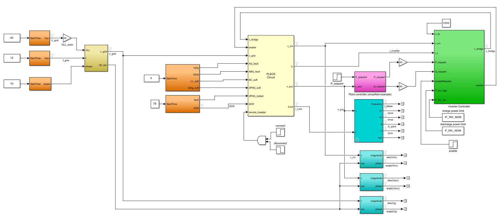
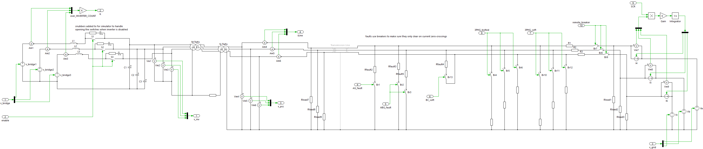
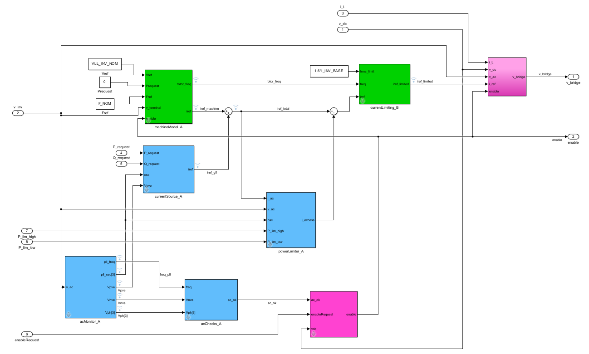
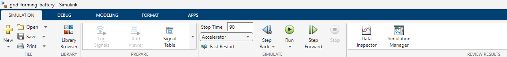
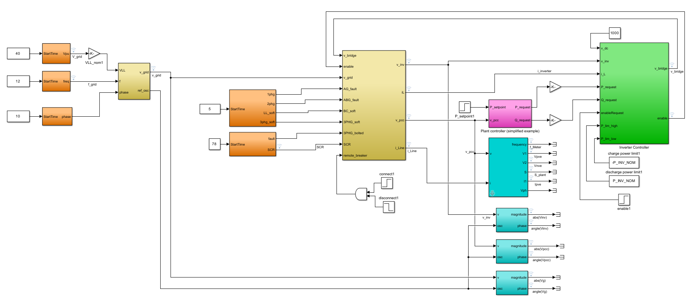
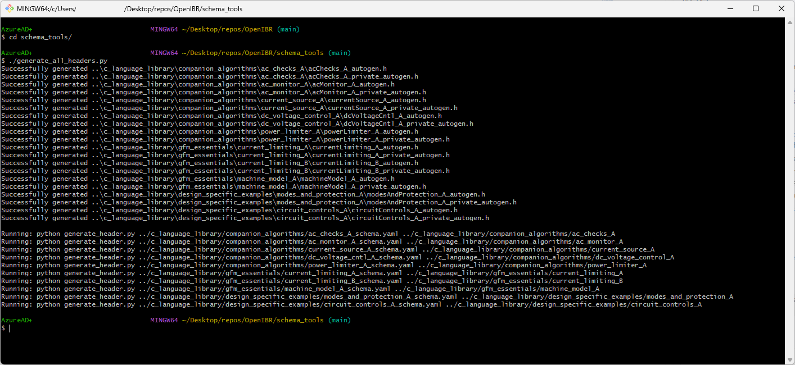
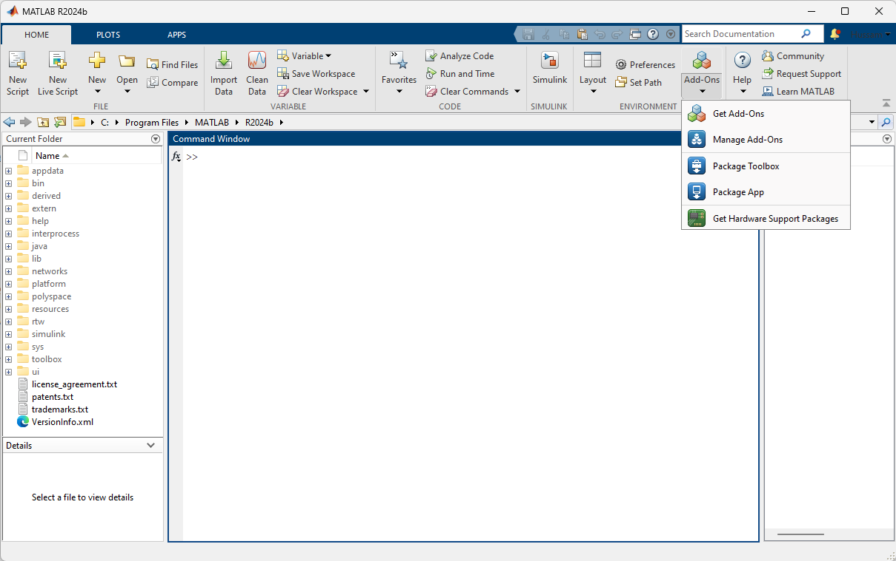
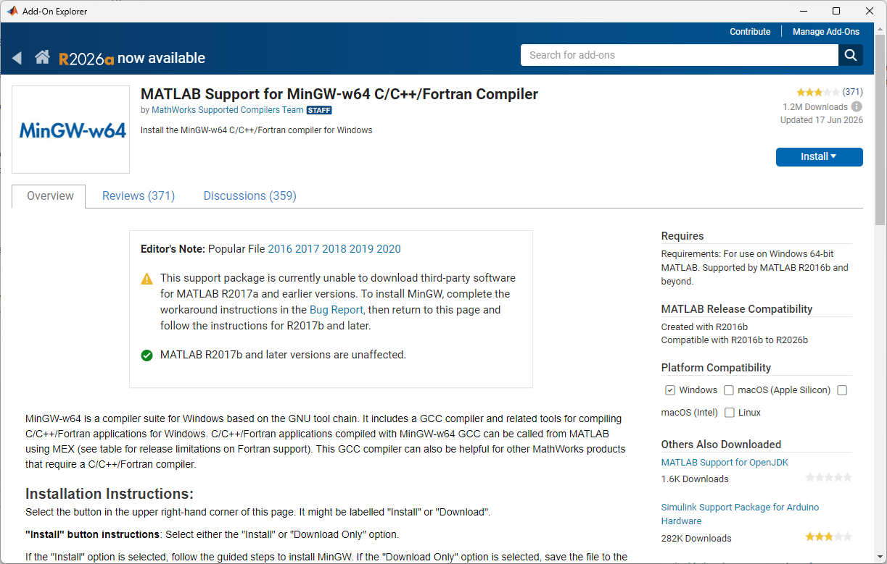

# Legal and contribution guidelines
Please start by reading our [contributing guidelines](../CONTRIBUTING.md).

## Note on library extensibility
The OpenIBR library was designed from the ground-up with modularity and extensibility in mind.  This is intended to support:

- Multiple styles of controller designs
- Evolution of algorithms over time

As of July 2026, only one style is actually captured in the library.  It is a detailed reference implementation of REGFM_C1 model.  We welcome collaboration with other manufacturers to capture alternative architectures and design variants.  More on this topic in the [controller integration guide](4_controller_integration_guide.md).

# What's in this repo?

This repository contains:

- Simulink reference models that capture the grid-forming design:
    - [Controls element library](../simulink_reference_models/controls_element_lib.slx) that are the building blocks of OpenIBR
    - Application example for a [battery plant](../simulink_reference_models/gfm_battery.slx), [data-center deployment](../simulink_reference_models/gfm_datacenter.slx), a [PV plant](../simulink_reference_models/gfm_pv.slx), and a [PV+supercap plant](../simulink_reference_models/gfm_pv_plus.slx)
    - [Test library](../simulink_reference_models/test_sequence_lib.slx) that includes circuit models, test sequencer blocks, and analysis blocks
- PSCAD models: these are 'open box' models that allow detail inspection of the algorithms and parameter configuration
- C-language library that implements algorithms in the controls element library.  This is structured for direct compilation into inverter code to implement the grid-interactive layer of the controls
- Schema tools for auto-generation of control element headers.  More on this topic in the [controller integration guide](4_controller_integration_guide.md).
- Simulink wrapper for exercising the code in the c-language library
    - Simulink unit tests: these are 'algorithm runners' that run one controls element each
    - Simulink software-in-the-loop (SiL) tests: these are models that run 'inverter apps' that combine a set of controls algorithms equivalent in functionality to the Simulink reference models for a [battery plant](../simulink_sil/gfm_battery_sil.slx), [data-center deployment](../simulink_sil/gfm_datacenter_sil.slx), a [PV plant](../simulink_sil/gfm_pv_sil.slx), and a [PV+supercap plant](../simulink_sil/gfm_pv_plus_sil.slx)
- Demo projects for a controller-hardware-in-the-loop (CHiL) environment, including:
    - An embedded project for a [TI Launchpad - F28P65x](https://www.ti.com/tool/LAUNCHXL-F28P65X)
    - Typhoon HiL models to run the TI Launchpad project
    - A python-based desktop GUI for sending commands to the TI Launchpad project
- IEEE/CIGRE real-code DLL packaging of the C-language library, loadable directly by EMT/RMS tools (PSCAD, EMTP, RTDS). See [Using the IEEE/CIGRE DLL](9_using_the_ieee_cigre_dll.md).
- Documentation:
    - Controller theory of operation, application notes, and an integration guide
    - A third party assessment [report](./third_party_assessments/HeronBESS_Model%20Quality%20test_Jul18_2026_final.pdf) for the Heron Link that demonstrates the use of OpenIBR to comply with established industry requirements

**Note:** Documentation uses md file format which is best viewed directly on github to ensure hyperlinks are working well.

**Be sure to maintain the folder structure on your local copy.** This is because different models, c-code, and scripts use relative path to find dependencies.

**Please use Matlab/Simulink version R2024B.** This is particularly true if you plan to submit change proposals.  Additionally, we have experienced some compilation issues with 2025 version, particularly for models that compile c-code (unit tests and inverter SiL).

# Getting started with the Simulink Reference Models

The four reference models [battery plant](../simulink_reference_models/gfm_battery.slx), [data-center deployment](../simulink_reference_models/gfm_datacenter.slx), [PV plant](../simulink_reference_models/gfm_pv.slx), and [PV+supercap plant](../simulink_reference_models/gfm_pv_plus.slx) provide Simulink-native representation of inverter controls using OpenIBR.  Using the battery model as an example, the model overview is shown below.

Yellow blocks represent electrical circuit models while orange blocks represent test sequences for voltage, phase, frequency, and electrical fault test cases.  These blocks are linked from the [test sequence library](../simulink_reference_models/test_sequence_lib.slx).

**Note:** the reference models use a PLECS-based ac-network simulation, whose structure is shown below.  PLECS is convenient but requires a separate license (available as trial or academic versions).  If access to PLECS is an issue, you can use an alternative Simulink-native block that is available in the same test sequence library.

The test sequence is an adaptation of ERCOT's [Advanced Grid Support Energy Storage Resource (AGS-ESR)](https://www.ercot.com/files/docs/2024/09/16/ERCOT%20Advanced%20Grid%20Support%20ESR%20Test%20Requirement_.pdf).

The controller itself is shown in green, and its internal structure is a combination of blocks from the [controls element library](../simulink_reference_models/controls_element_lib.slx) as shown in battery example below:

## Running the Reference Models
Just hit 'Run' on the Simulink native model if you have access to a PLECS Blockset license.  Use the 'Data Inspector' to visualize logged signals.

If you do not have access to a PLECS Blockset license, you can:
- Request a [trial license from Plexim](https://www.plexim.com/trial),
- OR replace the PLECS circuit model with the Simulink transfer-function-based circuit equivalent (also found in the test sequence library).

# Working with Simulink Software-in-the-Loop (SiL)

Simulink SiL leverages the same [test library](../simulink_reference_models/test_sequence_lib.slx) to exercise the c-language implementation of the controls elements.  You will notice a striking similarity between the Simulink SiL and the reference models, with the exception being that the controller is replaced by the C-function mentioned above.  We also utilize the native transfer-function based circuit simulator (for faster simulation).  Here's the equivalent battery inverter SiL for example:

## Running Simulink SiL
- Use Simulink R2024B.  We experienced issues (Matlab/Simulink hanging) when using 2025 versions
- Generate the element header files:
    - Be sure to have python and [dependencies](../schema_tools/python_requirements.txt) installed,
    - Using the 'generate_all_headers.py' python script in the [schema_tools folder](../schema_tools/).

    

- Install Matlab support for the MinGW C/C++ compiler.  This can be done through the add-Ons manager on the home toolbar as shown below

    

    

- Hit 'Run' from the Simulation toolbar and use the 'Data Inspector' to visualize logged signals.

**Important note:** It is convenient to use 'Rapid Accelerator' mode to speed up the simulation substantially.  We've found that if the c-language library changes, Simulink may neglect to recompile them when asked to run again.  To force a recompilation, delete the *.slxc files and ./slprj folder before running again.

# Using the PSCAD Model
See [Using the PSCAD Model](7_using_the_pscad_model.md).

# Using the HIL Project
See [Using the HIL Project](8_using_the_hil_project.md).

# Using the IEEE/CIGRE DLL
See [Using the IEEE/CIGRE DLL](9_using_the_ieee_cigre_dll.md).
