# Grid-Forming - Part 1: Reference Design
In this note, we present a reference design for grid-forming inverter controls.  These controls are designed to reproduce desirable characteristics of synchronous generators.  This is a grid-forming design that:
-	Can connect stably to a strong or weak grid,
-	Is capable of islanded operation and performing a blackstart function,
-	Sources “natural” fault currents dictated by the circuit impedance inclusive of the fault,
-	Is capable of sourcing imbalanced currents as dictated by circuit conditions such as imbalanced faults or loads,
-	Incorporates a current- and power-limiting mechanism while maintaining the above characteristics.

Note that many not-so-desirable complexities of a realistic synchronous machine are intentionally left out of the design.  This positions inverters to naturally fit the planning, operating, and protection framework of the power system while leveraging their key advantages over traditional machines in terms of speed and configurability.

The design is kept intentionally simple with a minimal set of relevant tunable parameters.  In [Part 2](./2_grid_forming_part2_design_and_tuning_guide.md) of this series, we also present a framework for tuning to ensure stability and compatibility with protection systems.

The grid-forming design is built around the concept of a simplified synchronous machine model as shown in Figure 1.  This model runs in real time and dictates inverter behavior.  It has an internal voltage reference (virtual EMF) connected to the terminals through an emulated (virtual) impedance network.

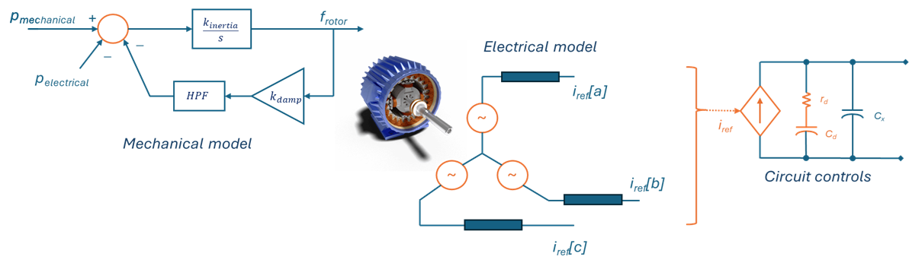

**Figure 1** Synchronous Machine Model Controls Concept

This design is realized through four main algorithms:
-	A mechanical model of a “virtual rotor” and prime-mover that determines rotating frequency and phase of the virtual EMF,
-	An electrical model of the excitation and virtual stator impedance that calculates instantaneous phase currents given terminal voltage measurements,
-	Current limiting responsible for “diverting” excessive currents so as to keep the RMS values within hardware limits,
-	Low-level “circuit controls” responsible for actuating the inverter hardware to generate said phase currents.  This is hardware design-specific, and its discussion will be limited as it is less relevant to external behavior.

**Note:** some supervisory subsystems are necessary to handle practical aspects such as state management, synchronization, and protections.  That additional layer of detail will be presented in a follow-on design note.

## The Mechanical Model
The mechanical model determines the frequency and phase of the rotor and emulated EMF.  The rotor model integrates the difference between mechanical and electrical power (as measured from the stator model) into an energy quantity that is then scaled to frequency.  An oscillator algorithm then generates three rotating phasors separated by 120 degrees. See Figure 2.

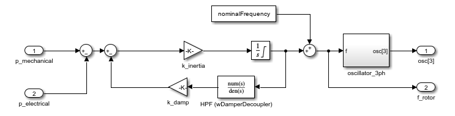

**Figure 2** Rotor & damping model

Just like a physical synchronous machine, the electrical power flow naturally synchronizes the rotor to the terminal voltage during operation.  The rotor model also includes a damper path reminiscent of windage and a damper winding.  This is required to provide dynamic frequency stability and is conditioned by a washout (high-pass) filter to avoid interference with steady-state droop.  This damping path can be set much stronger than is typical on a synchronous machine constrained by physical design.  More on that significant design advantage in a follow-on application note.

The mechanical power input to the virtual rotor is determined by a prime mover model, shown in Figure 3.  This power is simply the sum of the power request from dispatch added to the contribution of frequency/Watt droop.  A power component from a synchronizer algorithm is also added, but that term remains at zero during grid-forming operation (when the machine is enabled).  This component is used when the machine model is inactive in order to bring it and keep it in sync with terminal (grid) voltage.  *The synchronizer is disabled during normal grid-forming operation.*
 
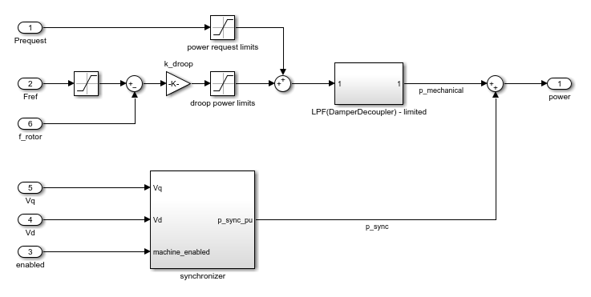

**Figure 3** Prime mover and power dispatch model

## The Electrical Model

The electrical model calculates the instantaneous inverter current required to reproduce the behavior of a voltage-source behind an impedance – see Figure 4.

**Figure 4** Emulated impedance network

Emulated (virtual) impedance consists of a series R-L path and is implemented as a transfer function (filter) applied to the difference between the virtual EMF and terminal voltage.  This is applied on a per-phase basis and in the time domain in order to give the instantaneous response necessary to shape the voltage waveform.  An additional resistive component is applied to the sum of all three currents, effectively acting as a neutral resistor.

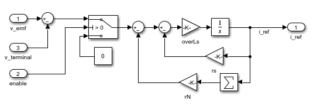

**Figure 5** Impedance emulation algorithm

The exciter algorithm is simple.  It modulates (scales) the oscillator sinewaves of the rotor by the desired voltage reference, which is a filtered version of the dispatch voltage reference.  To achieve smooth blackstart behavior, the voltage reference is limited to a threshold above terminal voltage as shown in Figure 6.  This will be discussed in more depth in a separate app-note.

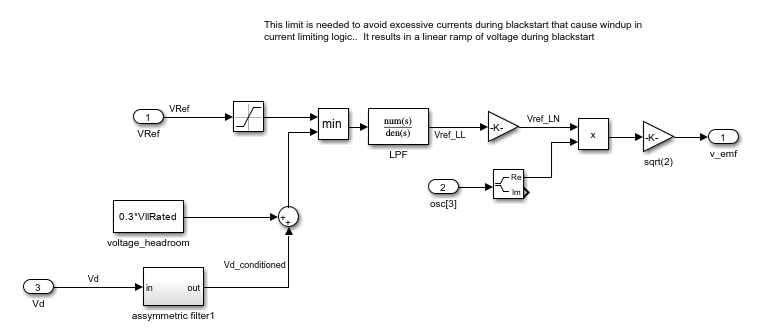

**Figure 6** Exciter model

## Current Limiting

Current-limiting functionality is needed to keep the inverter hardware within its limits to prevent damage. Upon an electrical fault or similar transient, current limiting is achieved through different mechanisms at different timescales:

- Emulated stator impedance limits the initial ac-current component for 1-2 cycles,
- Instantaneous peak current limits catch elevated peaks that may result from a decaying dc-bias due to a nearby electrical fault,
- Excess RMS current is gradually diverted away from the terminals using a separate "current-sink" algorithm.

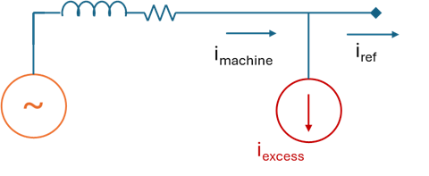

**Figure 7** Current limiting concept

**Figure 8** Typical current limiting behavior

This limiting paradigm was chosen in order to:
-	Enforce RMS current limits without impacting the voltage source nature of grid-forming responsible for shaping the line waveforms,
-   Preserve subcycle harmonic stability of the electrical (stator) model,
-	Avoid the complexity needed to manipulate the grid-forming machine model to limit its current,
-   Retain interoperability with common protective relay algorithms — more on this in [Part 3](./3_grid_forming_part3_compatibility_with_protection_systems.md).

**Note:** a similar 'diversion' strategy is used to enforce power limits of the battery or dc source.  More on this in the [integration guide](4_controller_integration_guide.md).

### RMS Limiting Strategy

The current-limiting element is captured in Figure 9 and works as follows:
-	The total pre-limit current references are fed to an RMS phasor estimation block,
-	The maximum of the three phase RMS currents is used to calculate a scale-factor to be applied across all phases, and a derived excess-fraction (complementary to 1.0),
-   This excess fraction is multiplied by a band-passed version of the pre-limit current reference for each phase to calculate excess currents,
-   Excess current is subtracted out of the current reference of each phase.

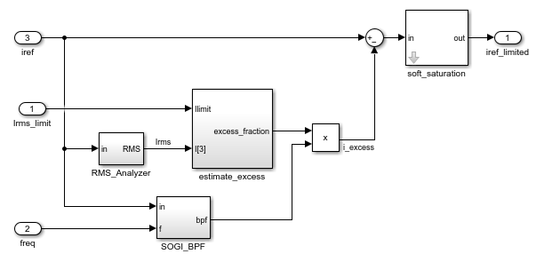

**Figure 9** RMS limiter algorithm

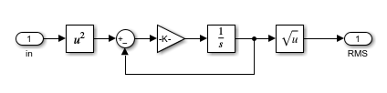

**Figure 10** Estimation of RMS currents

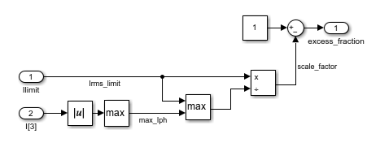

**Figure 11** Scalar current limiting strategy

This design utilizes a scaling strategy that scales direct and quadrature currents across all phases together, as shown in Figure 11.  This strategy aims to preserve the impedance-based behaviors and phase relationships required to interoperate with protection systems.  The resulting behaviors, depicted in Figure 8 above, are reminiscent of sub-transient and transient impedance characteristics of a synchronous machine.

**Note:** the RMS phasor estimation algorithm includes filtering with a time-constant of several cycles.  This introduces lag and provides “softness” necessary to maintain stability and avoid harsh current-source-like behaviors during limiting events.  The hardware design must include sufficient margin to account for this lag.

### Peak Current Limiting

A peak-current saturation function is applied to the time-domain references fed to circuit controls.  This limit is intended for short-term limiting while the RMS limit is catching up.  It is not intended to operate for any extended period as it can introduce undesirable nonlinearities and distortion. Applying a sharp saturation function can trigger oscillation and distortion at the saturation corner.  To improve that behavior, a soft-saturation function is recommended as shown in Figure 12 below:

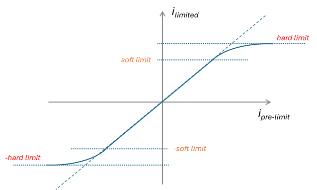

**Figure 12** Soft peak current-limiting characteristics

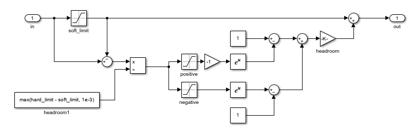

**Figure 13** Soft peak current-limiting algorithm

## Circuit Controls

This is the innermost layer of controls that is responsible for enforcing the current references handed to it from the electrical model.  This layer is hardware design-dependent, and is typically a group of high-bandwidth feedback controllers (PI controllers) applied individually to phase currents aided by a feed-forward calculation to generate PWM duty-cycles.

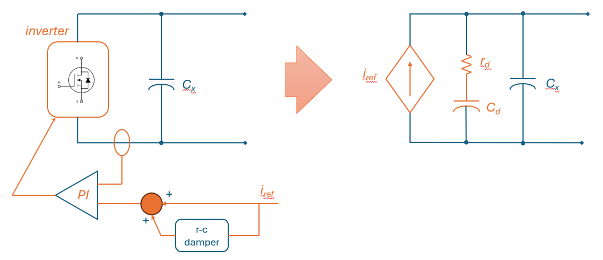

**Figure 14** Role of circuit controls

The stability of this layer must be studied carefully against the possible range of grid-impedance.  A virtual damper is recommended to guarantee stability across a wide range of impedances.  This is an emulated R-C across the output of the inverter, whose current is added to the reference that is enforced by the circuit controls.

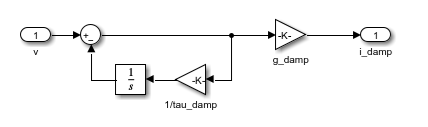

**Figure 15** Virtual damper algorithm

## Summary

Grid-forming controls can — and really should — be simple.  Arguably, the current-limiting approach introduces the most complexity.  This note presents a functional grid-forming design that utilizes a shunt-limiting method for current-limiting.  Scalar limiting is used to maintain compatibility with traditional protection systems.  Tuning, fault behaviors, blackstart capability, and supervisory logic will be discussed at length in subsequent parts of this series.

