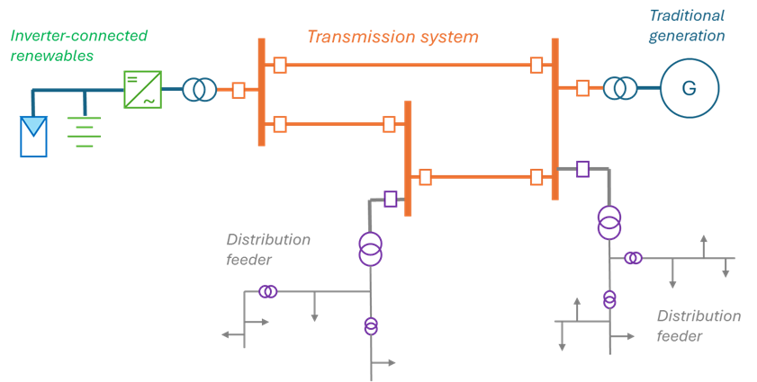
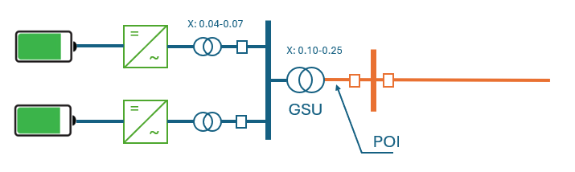
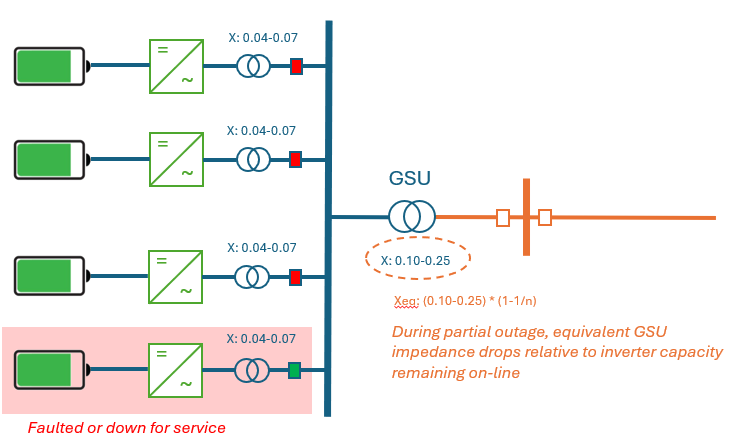
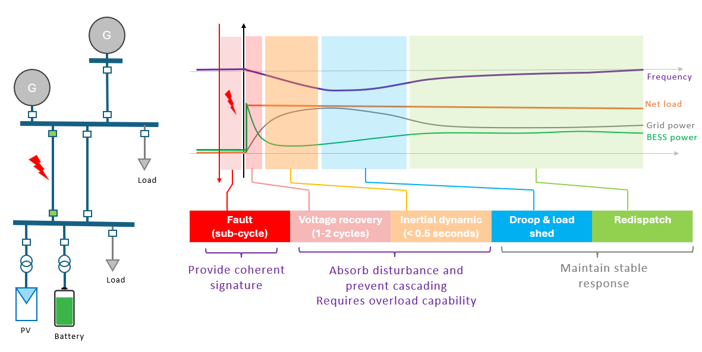
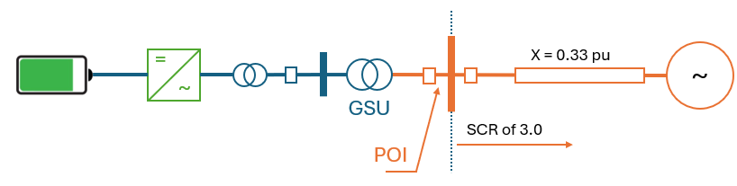
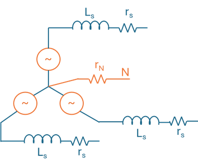
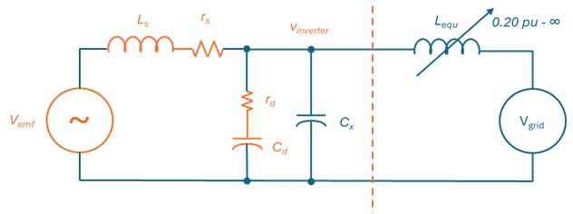
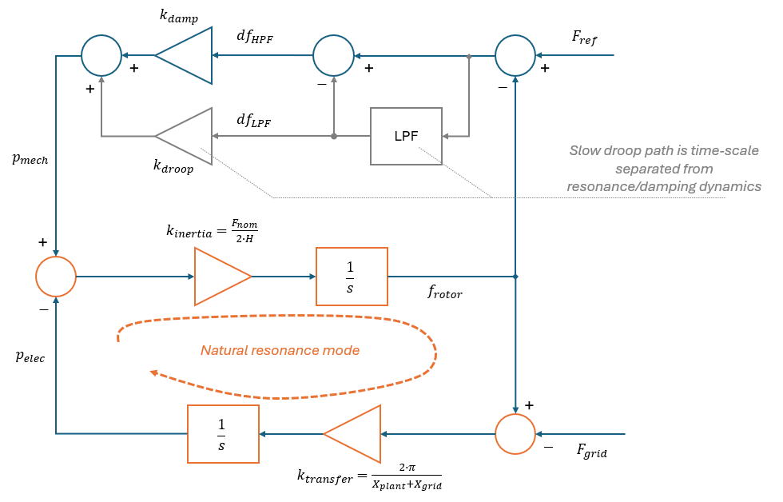

# Grid Forming - Part 2: Design & Tuning Guide

This note provides guidance on tuning the grid-forming design presented in [Part 1](./1_grid_forming_part1_reference_design.md) for utility-scale transmission-connected plants. We start with a discussion of the typical electrical system surrounding the inverter, then proceed to tuning guidelines and fault behaviors desired within that context.

## Operating Context

Figure 1 below is a simplified depiction of the grid architecture. The transmission system provides high-capacity interconnection of generation plants and large load centers. Its topology varies and often involves a mix of ring and radial structures according to local needs. Distribution feeds off that bulk system and fans out into lower capacity circuits - typically radial - that snake around residential neighborhoods and commercial areas. Renewable systems fit into two broad categories based on where they are interconnected:

- Smaller distributed energy resources (DER) connected to distribution
- Larger renewable energy plants connected directly to transmission

This note is solely focused on large transmission-connected plants. Distributed resources introduce opportunities and challenges worthy of discussion at length in a separate future note.

**Figure 1** Overview of Grid Architecture

### Plant Anatomy and Impedance

The anatomy of a typical battery storage plant is shown in Figure 2 below. Inverters interface the dc-resource to local collector buses at medium voltage, often through smaller medium-voltage transformers (MVTs). One or several generator-step-up (GSU) transformers then step that voltage up to the transmission voltage. The official point-of-interconnection (POI) is typically the high-side of that GSU.

**Figure 2** Typical utility-scale battery plant structure

Inverters are typically separated by one or two transformer stages from the grid, which add significant impedance. GSU transformers are often designed with a high leakage inductance in order to limit fault currents within the plant. GSU impedance is typically 0.10-0.25 pu. The smaller transformers within the plant typically add 0.04-0.07 pu. All in all, inverters are separated from the grid by 0.15-0.30 pu impedance under nominal conditions.

#### Partial Plant Operation

Battery plants are highly modular, and can be partially operated – say during maintenance. The effective per-unit impedance of the GSU then drops relative to the rating of inverters remaining online. When tuning inverter controls, it is important to account for this condition while recognizing it as a corner case. Even under significant levels of partial operation, it is difficult to find realistic scenarios where the effective impedance within the plant drops below 0.15 pu.

For tuning purposes:

$$ X_{MVT} + X_{GSU} \geq 0.15 pu $$

**Figure 3** Utility-scale battery plant with partial outage

More impedance lies upstream of the POI, representing the Thevenin impedance of the grid network at that point. That impedance can vary significantly depending on the network topology, interconnection location, and operating conditions. To account for this, we set the requirement for stable operation against a wide range of grid impedances: 

- Very strong connection with $X_{grid} \approx 0$
- Weak connection with $X_{grid} > 0.5$ pu
- OR Practically islanded with $X_{grid} \gg 1$ pu.

#### Inverter Wiring and Transformer Winding Configuration

Utility-scale inverters are typically 3-wire connections: they lack a neutral connection to the system. The GSU typically provides a zero-sequence current path to upstream faults through a delta-connected secondary (MV) winding or a delta tertiary.  This helps keep voltages properly referenced to ground, irrespective of the operating state of the inverter systems.

### Power System Protection Schemes

The power system relies on sophisticated protection relays to detect and isolate electrical faults such as downed lines or shorts caused by lightning, vegetation, or airborne debris. Protection relays look for dynamic signatures in voltage and current quantities expected in power systems. **Care must be taken to ensure inverter dynamic behaviors support — not invalidate — such assumptions.**

To maintain broad protection relay compatibility, transmission-connected plants should provide 'coherent' fault currents.  This means instantaneous (sub-cycle) fault current signatures dictated by the electrical path to the fault.  This means that the inverter should not actively 'inject' sequence components, but rather allow them to flow through impedance emulation as dictated by the stator electrical model.  RMS current limiting must happen gradually to avoid offending memory-polarized elements, and respect the relative phase relationships of symmetrical components.  Crucially, transmission protection only imposes modest over-current requirements, typically in the 1.5-2.0 pu range.

A more detailed discussion of this topic is provided in the [protection compatibility guide](3_grid_forming_part3_compatibility_with_protection_systems.md).

## Dynamic Behavior Objectives

Within the electrical context laid out above, a well-designed grid-forming plant should:

- Produce high-quality voltage waveforms: keep local voltage balanced with low harmonic distortion,
- Maintain frequency and phase stability: provide stable voltage with damped frequency and phase changes consistent with internal impedance,
- Parallel stably to a large grid system (the proverbial infinite bus), or to similar grid-forming inverter resources in an islanded setting,
- Ride through faults and provide appropriate current signatures compatible with protection systems,
- Recover from reasonable disturbances, and arrive at a stable operating point indicated by post-fault system state.

### Stages of Electrical Fault Recovery
Following the incidence of an electrical fault, the system recovers by clearing a transmission line, generator, and/or load.  This causes a sudden shift in local power flow as it recovers, triggering a series of events that can broadly be categorized into four stages of recovery:

| Stage     |   Duration        |   What is occurring?                                                      |   What is needed for system stability?                                |
|-----------|-------------------|---------------------------------------------------------------------------|-----------------------------------------------------------------------|
| Stage 1   |   1-2 cycles      |   Voltage recovers with sudden phase jump depending on impedance network  |   Keeping phase jump low to avoid cascading events (mass tripping of adjacent systems)    |
| Stage 2   |   10-30 cycles    |   Power flow re-adjusts associated by a rapid change in local frequency dictated by inertial dynamics of local devices and grid strength   |   Keeping the rate-of-change-of-frequency (RoCoF) low is important to avoid cascading events (mass-tripping of adjacent systems)  |
| Stage 3   |   Seconds         |   Adjusted power flow based on frequency-droop characteristics            |   Arrive at stable voltage and frequency                              |
| Stage 4   |   Minutes         |   System is redispatched to a new steady-state                            |   Tight voltage and frequency regulation                              |

**Figure 4** Stages of electrical fault and recovery

Grid-forming inverters can and must assist the system in stages 1 & 2, the most crucial to avoid a domino effect that results in mass tripping of local devices.  A grid-forming inverter helps reduce this phase jump by providing subcycle reactions defined by its stator characteristics and the electrical path to the disturbance.

### Implications for Inverter Behavior

So how can inverters provide proper dynamic behaviors? This requires attention to electrical tuning, mechanical tuning, current-limiting behavior, and underlying hardware capabilities:

- Electrical dynamics: achieving high voltage quality requires careful design of electrical model parameters and virtual damping,
- Impedance value: must present a low-enough impedance to help limit the phase jumps resulting from abrupt power flow changes,
- Mechanical dynamics: frequency stability and parallel operation require proper choice of inertia and damping gain,
- Fault behavior: coherent fault currents dictated by the impedance path, followed by gradual scaling-based current limiting for compatibility with protection relays,
- Overload capability: the inverter must have sufficient overload capability to carry the system through a disturbance until the fault is cleared or load is rebalanced. 

### How much impedance and inertia?

Performance parameters depend heavily on planning assumptions, and the tolerances of devices to voltage, phase, and frequency disruptions.  Fortunately, one can look to published requirements such as ERCOT's AGS-ESR for specific values.  AGS-ESR explicitly calls for a minimum inertial constant (H) of 2.5 seconds.  It also requires consistent delivery of energy for a 1 Hz/second event that lasts 0.5 seconds.  AGS-ESR also requires a 0.2 pu power response to a 10-degree phase jump on a grid connection with a short-circuit ratio (SCR) of 3.

**Figure 5** Test system for phase jump power response under ERCOT's AGS-ESR requirements

For a given phase shift:

$$ \Delta P = \frac{|V|^2 \cdot \sin(\Theta)}{X_{plant}+X_{grid}} $$

or

$$ X_{plant} \leq \frac{|V|^2 \cdot \sin(\Theta)}{\Delta P} - X_{grid}$$

$$ X_{plant} \leq \frac{\sin(10^\circ)}{0.2} - 0.33 \approx 0.5 \text{pu}$$

Given these values of impedance and inertia, we can proceed to derive tuning for the electrical and mechanical modes, as well as hardware overload capabilities.

## Tuning the Electrical Model

### Stator Impedance

**Figure 6** Emulated stator impedance network

Emulated stator impedance is set in order to achieve a total plant impedance (to POI) less than 0.5 pu:

$$X_{plant} = X_s + X_{\text{MVT}} + X_{\text{GSU}} \leq 0.5 \text{pu}$$

Taking representative values of $X_{\text{MVT}} = 0.05$ pu and $X_{\text{GSU}} = 0.15$ pu:

$$X_s \leq 0.5 - 0.05 - 0.10 = 0.35 \text{pu}$$

We choose $X_s = 0.3$ pu.  This provides a good balance that is strong enough to maintain a good voltage waveform without over-contributing transient currents during dynamic events.

Stator resistor, $r_s$, helps dissipate dc-current caused by circuit and controller imperfections or those triggered during transient due to point-on-wave effects. Set this to achieve a stator time-constant roughly equal to a single line-cycle:

$$\tau_s = \frac{L_s}{r_s} = \frac{1}{f_{\text{nom}}}$$

Rearranging, and assuming stator impedance of 0.3 pu:

$$r_s = \frac{\omega_{\text{nom}} \cdot L_s}{2 \cdot \pi} = \frac{X_s}{2 \cdot \pi} = \frac{0.30}{2 \cdot \pi} \approx 0.05 \text{pu}$$

Neutral resistance does not play a significant role in 3-wire connected inverters, and should generally be kept low to mitigate inverter voltage imbalance due to current-sense imperfections. For 4-wire systems (inverter neutral accessible), some resistance in the 0.1-0.2 pu can mitigate circulating currents into adjacent inverters & transformers that may be caused by voltage sense/control imperfections.

### Virtual Damping

The physical filter capacitor network ($C_x$) normally found in the ac-filter creates a resonant pair with grid-side inductance. This is particularly true if the circuit-level controls enforcing current reference are high-bandwidth as is desired to guard hardware. If left unmitigated, this can cause excessive current and voltage distortion and may even lead to instability and repeated tripping of the inverter.

**Figure 7** Single-phase equivalent circuit with damping

Virtual damping is a very effective approach to damping this resonance. This is a parallel resonance system, so we shoot for a critically-damped system at the worst-case (minimum) grid-side inductance. While it is possible to attain stability with an under-damped system, that may still amplify harmonic content from the inverter or the grid voltage.

$$L_{\text{min}} = L_s \parallel L_{\text{equ min}}$$

$$X_{\text{min}} = X_s \parallel (X_{\text{GSU}}+X_{MVT})$$

$$X_{\text{min}} = 0.3 \parallel 0.15 = 0.10 \text{pu}$$

For critical damping:

$$1.0 = \xi = \frac{1}{2 \cdot r_d} \cdot \sqrt{\frac{L_{\text{min}}}{C_x}}$$

$$r_d = 0.5 \cdot \sqrt{\frac{L_{\text{min}}}{C_x}} = 0.5 \cdot \sqrt{\frac{X_{\text{min}}}{Y_{Cx}}} = 0.5 \cdot \sqrt{\frac{0.1}{0.04}} \approx 0.8 \text{pu}$$

In this linear system, harmonics at the inverter terminals can be evaluated as the impedance divider of the inverter and grid-side impedance. This means that, in the absence of resonance, inverter voltage will have less distortion than its own EMF and the grid voltage – unless there is resonance. Tuning for critical or over-damping eliminates such resonance. For a given harmonics limit, connecting a compliant inverter to a compliant grid results in a compliant terminal voltage.

For effective damping, we choose the (virtual) damper capacitor at 3x the physical capacitor. The physical capacitor value is highly dependent on the hardware design. For typical modern designs, its admittance is typically in the 0.04 pu range:

$$C_d \geq 3 \cdot C_x$$

$$Y_{Cd} \geq 3 \cdot 0.04 \, \text{pu} = 0.12 \text{pu}$$

### Exciter Parameters

The exciter utilizes a low-pass filter (LPF) to ensure voltage changes smoothly. The time-constant of this filter should be much higher than a line-cycle to minimize distortion:

$$\tau_{\text{exciter}} \gg T_{\text{cycle}}$$

$$\tau_{\text{exciter}} \geq 0.1 \text{s}$$

The exciter RMS voltage is limited to a constant headroom above the voltage reading in order to prevent units "fighting" and overloading each other during collective blackstart. That headroom is also proportional to the blackstart ramp-rate. The headroom should be high enough to allow the inverter to provide its full transient overload capability:

$$V_{\text{headroom}} \leq X_s \cdot I_{\text{overload}} = 0.30 \cdot 1.5 = 0.45 \text{pu}$$

## Tuning the Mechanical Model

Typical grid inertial constant, $H$, is 2 to 7 seconds. $H$ is defined as the kinetic energy stored in the rotor at nominal frequency divided by the nominal power rating. Translating this to machine parameters requires linearizing around nominal frequency, and results in:

$$k_{\text{inertia}} = \frac{F_{\text{nom}}/2}{H \cdot S_{\text{rated}}}$$

We target a machine on the lighter side in this guide with $H=2.5$ sec, aligned with ERCOT's AGS-ESR spec:

$$k_{\text{inertia}} = \frac{60/2}{2.5 \cdot 1} = 12 \frac{\text{Hz}}{\text{pu}}$$

The dynamic transfer function representation of the mechanical dynamics is shown in Figure 8.  Notice the double-integrator loop formed by the mechanical inertia and electrical power transfer driven by the phase angle.  This forms a natural resonance with a resonant frequency of:

$$\omega_r = \sqrt{k_{\text{transfer}} \cdot k_{\text{inertia}}}$$

**Figure 8** Mechanical dynamics when connected to an infinite bus

The damping gain acts as a parallel RLC damper, which is least damped at minimum inductance, which occurs at minimum grid-side impedance (strongest grid):

$$k_{\text{transfer}} = \frac{2 \cdot \pi \cdot |V|^2}{X_s + X_g} = \frac{2 \cdot \pi \cdot 1}{0.3 + 0.15} = 14.0$$

Assuming $H=2.5$ seconds as stated above (and $k_{\text{inertia}}$ of 12.0), the natural frequency is then:

$$\omega_r = \sqrt{k_{\text{transfer}} \cdot k_{\text{inertia}}} = \sqrt{14.0 \cdot 12.0} \approx 13.0 \text{rad/sec}$$

For critical damping, choose damping gain based on:

$$\xi = \frac{k_{\text{damp}}} {2} \cdot \sqrt{\frac{k_{\text{inertia}}}{k_{\text{transfer}}}}$$

$$ k_{\text{damp}} \geq 2 \cdot \xi \sqrt{\frac{k_{\text{transfer}}}{k_{\text{inertia}}}}$$

$$k_{\text{damp}} > 2.1 \text{pu/Hz}$$

For the damper to be effective, the damper time-constant must be set high relative to the natural resonance frequency:

$$\tau_{\text{damp}} \gg \frac{1}{\omega_r} \approx 0.077 \text{s}$$

We recommend a time-constant of 0.3 seconds. This long time-constant ensures rotor stability and dynamics are dominated by this damper path and have very little dependence on (steady-state) droop settings which are more likely to change.  With critical damping on the mechanical resonant frequency, the machine model will always add small-signal stability.  If both the inverter and the grid are well-damped, there is little risk of instability.

## Hardware Overload Capability

With a plant impedance, $X_{plant}$, of 0.5 pu, we can calculate the inverter hardware capability required for coherent transient responses and gradual limiting.

### Short-term overload for stage 1 of event recovery (1-2 cycles)
For a worst-case bolted fault at the POI, the ac-current simply is:

$$ I_{\text{fault}} = \frac{|V|}{X_{\text{plant}}} = \frac{1.0}{0.5} = 2.0 \text{pu} $$

Additionally, IEEE2800-2022 requires ride-through of a phase jump up to 25 degrees.  Combined with the above impedance calculation, this implies a transient power delivery of:

$$ \Delta P = \frac{{|V|}^2 \cdot \sin(25^\circ)}{X_\text{plant}} = \frac{1 \cdot \sin(25^\circ)}{0.5} = 0.85 \text{pu}$$

Assuming a pre-event power flow of 1.0 pu, the power delivery must jump to 1.85 pu, which must be supported by both the battery and the inverter for ~2 cycles.

### Peak Overload Capability
Considering the above calculation, the hard peak-current limit must be some margin above the fault current so it can primarily deal with the point-on-wave decaying dc component:

$$I_{\text{hard-limit}} = \sqrt{2} \cdot I_{\text{fault}} \cdot 1.25 = \sqrt{2} \cdot 2.5 \text{pu}$$

The soft current limit is recommended at 2/3 of hard limit:

$$I_{\text{soft-limit}} = \sqrt{2} \cdot 1.8 \text{pu}$$

### Transient overload for stage 2 of event recovery

During the inertial recovery phase, the inverter is called upon to deliver power.  For a critically damped system, the damper power term dominates power delivery:

$$ \Delta P_\text{damper} = 1.2 \cdot \tau_\text{damp} \cdot D \cdot \frac{df}{dt} $$

For a 1 Hz/sec RoCoF for 0.5 seconds specified in ERCOT's AGS-ESR requirement:

$$ \Delta P = 0.3 \cdot 2.1 \cdot 1.0 = 0.6 \text{pu} $$

Combined with a pre-event dispatch of 1.0, this implies a power overload of 1.6 pu for 0.5 seconds, and a similar RMS current limit for that duration.  This is sufficient for stage 2 of an event recovery.  This capability supports temporary overloads and provides sufficient time for loads to be shed and/or faults to be cleared to stabilize the system.

**Note:** IEEE2800-2022 requires ride-through of 5 Hz/sec events.  During such a severe event, it is reasonable to expect limiting functions to kick in to keep power/current overload at the value calculated above.

### RMS Current Estimation & Limiting Time-Constant

The time-constant at which RMS current is estimated also implies that at which it gets limited. This time-constant should be set large enough to filter rapid sub-cycle changes, which translate to distortion, while also remaining well below overload duration so as not to interfere with its enforcement.

$$T_{\text{cycle}} \leq \tau_{\text{estimation}} \ll T_{\text{overload}}$$

Given these constraints, the estimation time-constant is recommended at 20 msec.

## Summary

The following design and tuning parameters are recommended for a grid-forming inverter intended for utility-scale transmission-connected plants. These values are intended to achieve key dynamic performance objectives outlined in this note. They were derived based on typical plant characteristics while leaving sufficient stability margin for variations of the electrical network around the inverter.  These values are expected to yield good behavior for the vast majority of utility-scale plants. They are our best recommendation for universal tuning of grid-forming controls.

To facilitate power system planning, it is recommended to keep a handful of 'top-level' configurable parameters defined in terms familiar in the traditional stability framework.  **We recommend presenting inertial constant ($H$), damping gain ($D$), and stator impedance ($X_s, r_s$) as configurable settings,** while discouraging the customization of other parameters in the planning process.

Recommended Hardware Capability and Controls Parameters:

| Category | Parameter | Symbol | Recommended Value | Notes |
|----------|-----------|--------|------------------|--------|
| Mechanical model parameters | Frequency-Watt droop | $k_{\text{droop}}$ | 1 pu/Hz | |
| | Inertia constant | $H$ | 2.5 sec | $k_{\text{inertia}} = 12.0 \, \text{Hz/pu}$ |
| | Damper gain | $D = k_{\text{damp}}$ | 2.0 pu/Hz | For critical damping |
| | Damper time-constant | $\tau_{\text{damp}}$ | 0.3 sec | $\omega_\text{damp} = 1/\tau_{\text{damp}}$, separates droop from damping dynamics |
| Electrical model parameters | Stator reactance | $X_s$ | 0.3 pu | set to achieve plant impedance $X_{plant}$ at 0.45-0.5 pu |
| | Stator resistance | $r_s$ | 0.05 pu | |
| | Neutral resistance | $r_N$ | 0.2 pu | Relevant to 4-wire systems |
| | Exciter voltage headroom | $V_{\text{headroom}}$ | 0.45 pu | Prevents overloading during blackstart |
| | Exciter voltage time-constant | $\tau_{\text{exciter}}$ | 0.1s | $\omega_\text{exciter} = 1/\tau_{\text{exciter}}$|
| | Damper resistance | $r_d$ | 0.8 pu | Critical damping |
| | Damper capacitance | $Y_{\text{Cd}}$ | 0.12 pu | $C_d = Y_{\text{Cd}} / \omega_{\text{nom}}$ |
| Overload and current limiting | RMS estimation time-constant | $\tau_{\text{estimation}}$ | 20 msec | $\omega_\text{estimation} = 1/\tau_{\text{estimation}}$ (impacts HW design) |
| | Stage 1 overload limit | $I_{\text{overload1}}$ | 2.0 pu | HW design parameter |
| | Stage 1 overload duration | $T_{\text{overload1}}$ | 40 msec | HW design parameter |
| | Stage 2 overload limit | $I_{\text{overload2}}$ | 1.6 pu | HW design parameter |
| | Stage 2 overload duration | $T_{\text{overload2}}$ | 0.5s | HW design parameter |
| | Soft current limit | $I_{\text{soft-limit}}$ | 2.55 pu | Instantaneous |
| | Hard current limit | $I_{\text{hard-limit}}$ | 3.54 pu | Instantaneous, HW design parameter |
