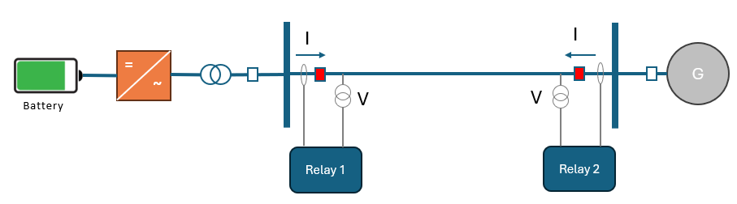
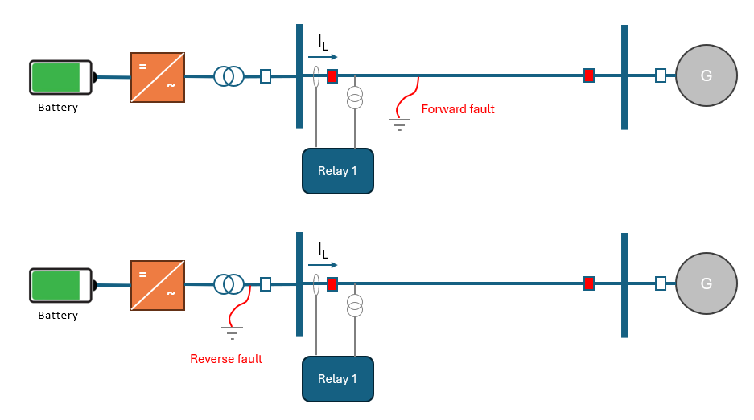
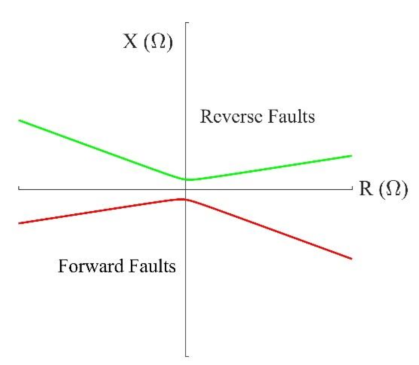
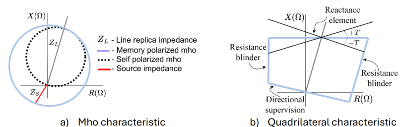
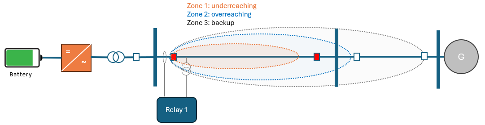
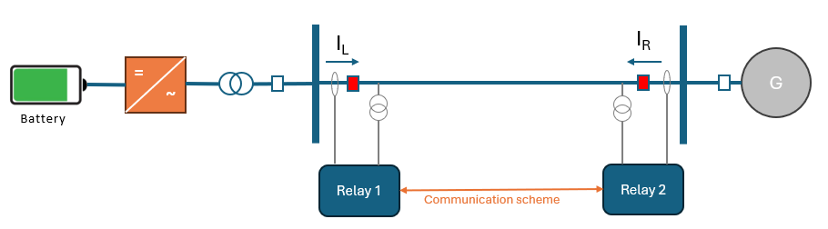
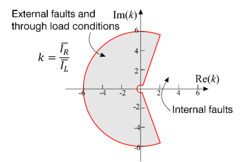
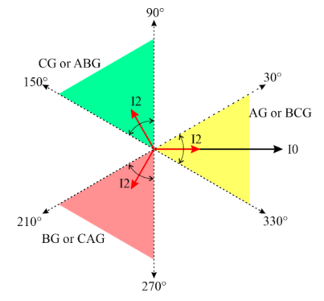
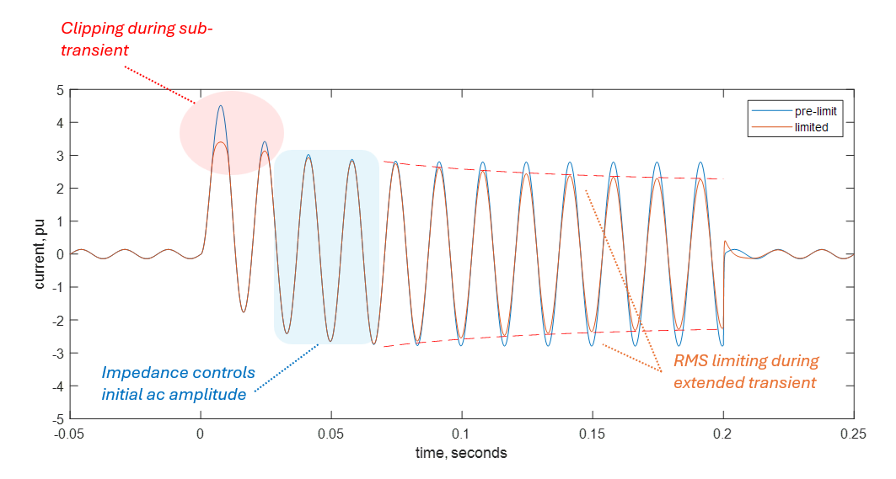

# Grid Forming - Part 3: Interoperability with Protective Relays

In this note, we review the basics of transmission protection systems and discuss preferred inverter behavior to maintain interoperability.  This is meant as a primer - not a comprehensive guide.

Protective relays are sophisticated devices designed to monitor the power system, detect electrical faults or anomalies, and act rapidly to isolate and minimize the impact of faults before they propagate into larger events.  Protective relays evolved significantly over many decades, progressing from simple electro-mechanical systems to microprocessor-based digital relays with sophisticated protective schemes and diagnostics.  Throughout their evolution, protective schemes baked-in assumptions about system behavior dominated by rotating synchronous generation and employed them to improve their performance metrics in terms of security (lack of nuisance trips) and dependability (consistent tripping for real faults).  Proliferation of software-driven inverter-based systems and converter-based large loads introduces behaviors that can degrade protective relay performance.  On the transmission system, the inverter challenge to protection revolves around fault signatures, not-so-much around hardware limitations to overload currents.

This note:

- Covers the very basics of protective relaying schemes,
- Discusses potential challenges with inverter proliferation,
- Outlines how inverter controls can be shaped to address interoperability with protection systems.

## The basics

Consider a simple configuration shown in Figure 1.  Two protective relays are deployed at two ends of a transmission line.  Each relay senses the local 3-phase voltage and current waveforms, and processes them to extract and monitor several quantities such as:

- Voltage phasors,
- Current phasors,
- Symmetric components: positive, negative, and zero-sequence components of voltage and current,
- Line frequency,
- Harmonic content.

**Figure 1** A transmission line with protective relays

A protective relay is configured to use combinations of these quantities to (a) detect a fault (b) infer the location (conductor(s), distance, direction) (c) isolate the faulted section, and (d) provide information for service crews.

Symmetrical component analysis is particularly useful in transmission protection.  Load at the transmission level tends to be well balanced due to statistical diversity, so the presence of negative-sequence (V2, I2) and zero-sequence (V0, I0) components is highly correlated to unbalanced faults.  Crucially, the relative magnitude and phase relationships of these quantities is rich with clues as to the nature and location of an electrical fault.  For a more in-depth background on symmetrical components and their utility for protection, refer to [Introduction to Symmetrical Components](https://share.google/ZgKXEt4IARgqhZ32K) from SEL Inc.

Time is of the essence on the transmission system.  Fast fault clearing is important to reduce the impact of short-circuit current in electrical equipment and preserving power system stability.  Usually, conventional protection schemes are designed to detect faults within 1 to 3 cycles of the power system frequency and trip the faulty equipment.

### Directional Protection

Consider two electrical fault scenarios on either side of Relay 1.  In both cases, elevated fault current will be observed by the relay.  Directional protection relies on symmetrical components analysis to determine fault direction by monitoring the phase angle relationship between sequence voltages and currents. Therefore, the relay can determine whether the fault is forward or reverse relative to its location.  The directional protection operates supervising other main protection elements, such as overcurrent and distance.

**Figure 2** Forward and reverse faults relative to the relay location.

Negative-sequence directional protection is particularly popular.  It relies on estimating negative-sequence impedance ($Z_2 = V_2/I_2$) to determine if the fault is forward or reverse relative to the relay location. Figure 3 presents the negative-sequence directional characteristic in the impedance plane. The estimated negative-sequence impedance $Z_2$ falls below the red line during forward faults, and it falls above the green line during reverse faults.  The relay compares $Z_2$ with forward and reverse thresholds to determine fault direction.

**Figure 3** Negative-sequence directional element visualization in the impedance plane.

### Distance Protection

Distance protection is a particularly common transmission line protection scheme.  It uses an impedance estimate to the fault location to estimate the distance based on known impedance/mile characteristics of the line guarded by the relay.  

Distance elements compute an apparent impedance using the ratio of the voltage and currents at the relay location ($Z=V/I$). The estimated impedance is compared with the distance operating characteristics configured in the relay. Figure 4 shows the two most common distance element operating characteristics: the 'mho' and 'quadilateral' characteristics.  The 'mho' characteristic is a simple circular region. The quadrilateral characteristic is an evolution of the same technique that is shaped more precisely using a reactance reach, two resistive blinders, and a directional supervision element. If the relay estimates an impedance that falls within the configured characteristic, it indicates a fault within the protected zone, and the relay issues a trip signal to the circuit breaker.

**Figure 4** Typical characteristics of distance elements

To deal with sensor inaccuracies and prevent coverage gaps, a system is protected with a combination of 'underreaching', 'overreaching', and backup zones that are time-coordinated for a desired outcome.  An 'underreaching' zone refers to a protection setting typically configured for 80-90% of the line impedance (therefore covering same percentage of its length).  An 'overreaching' zone extends beyond the impedance of the line and is used to cover the rest of the distance.  The scheme relies on a distant relay tripping first if the fault is actually in the 'overreach' section - outside of the line under protection.  A backup zone employs an even longer time delay to provide an additional layer of protection in case the primary protective scheme of an adjacent section failed to operate.  Backup schemes are typically configured with 20-30 line cycles of delay (0.3-0.5 seconds).

**Figure 5** The concept of zones in distance protection

### Line Differential Protection

Differential protection builds on the simple concept that currents entering and leaving the protected zone should add-up to zero.  If not, that is an indication of an internal fault.  For a line-differential scheme, two relays on either end of the line are configured each to measure the local current, receive a remote measurement from the other end, calculate the differential current and trip if that exceeds a threshold typically set as a fraction of the current reading.  The threshold is there to account for measurement accuracy, time synchronization between the two relays at either end, and line charging current due to the transmission line shunt capacitance.

**Figure 6** Line-differential protection configuration

Modern line current differential relays use the generalized 'alpha plane' formulation for the phase, ground, and negative-sequence elements as shown in Figure 7.  The alpha plane is defined by the ratio of the remote to local current phasors, denoted as the complex factor $k$. If $k$ falls within the shaded restraint region, the differential element remains blocked (does not trip). However, if $k$ lies outside this region, a trip command is issued.  This technique allows for improved security and a more sophisticated approach for accounting for potential sources of error in the differential scheme.

The differential technique is conceptually simple. It is usually a more secure scheme for line protection near inverter-based generation. Still, it relies on a communication channel that if lost, the line-differential element cannot operate and is blocked, leaving backup functions such as distance protection to protect the line.

**Figure 7** The alpha-plane representation for differential protection

### Fault Identification Logic

Fault Identification Logic (FID) determines which phases are involved in the fault to allow the proper distance element to operate and clear the fault event. This ensures that the relay evaluates the appropriate phase-to-ground or phase-to-phase distance loop and blocks loops that could operate incorrectly during close-in faults. The selection logic uses the phase angle relationship between the negative-sequence and zero-sequence currents. Under ideal conditions, this relationship falls within one of three primary 60-degree sectors, which are shown as the yellow, green, and red regions in Figure 8. Each sector identifies a set of candidate fault types specific to that sector. The relay subsequently evaluates the corresponding distance loops and selects the most likely faulted loop.

**Figure 8** Fault identification logic zones

FID logic is routinely supervised (gated) by a condition that checks that negative-to-zero-sequence magnitude ratio ($|I2/I0|$) is above a minimum threshold.  At a renewable plant, $I2$ may be limited by the inverter controls, while a grounded-wye transformer GSU can provide a relatively low-impedance path for $I0$. Consequently, the $I2/I0$ ratio may be low, potentially blocking the directional supervision. A GSU with a higher zero-sequence impedance can reduce $I0$ and alleviate this concern.

## Implication for Inverter Behaviors

There are a few important highlights related to inverter behavior:

- Voltage is often used as the polarizing quantity.  In other words, voltage information is used to establish and track a reference angle against which current phase is evaluated to make decisions.  Therefore, phase relationships must remain coherent and predictable between voltage and current signals.

- Many relays use the concept of 'memory polarization' where the voltage information from one or several past cycles is used as the reference polarizing angle.  The polarizing angle for fault current must remain stable with gradual changes. This is particularly important to consider when current-limiting is in effect.

- Negative sequence current reactions must effectively be instantaneous to enable fast relay operation similar to what is expected in conventional systems dominated by synchronous generators (1 to 3 cycles), and to stay coherent during evolving faults.  Delayed reactions such as those permitted in IEEE2800-2022 can cause serious degradation in protection performance.

- None of these schemes directly imposes a requirement of high overload current capability. Overcurrent can be used as a trigger, but is often set relatively low (e.g. 150-200% of expected load current).  Some overload capability is indirectly required to allow for graceful current-limiting behavior as discussed below.

### How is this addressed with OpenIBR?

By virtue of the stator model operating in instantaneous time-domain, the machine model is setup to provide fault currents shaped by the full impedance path to and inclusive of the fault.  This naturally provides an instantaneous and coherent sequence-component reactions even if the fault evolves.  However, attention is needed to ensure current-limiting does not interfere with this natural signature.

Upon an electrical fault or similar transient, the fault current contribution from an OpenIBR inverter goes through two main stages:

- Emulated stator impedance limits the initial ac-current component for 1-2 cycles,
- Excess RMS current is gradually diverted away from the terminals using a separate 'current-sink' algorithm.

**Figure 9** Typical current limiting behavior

Within this context, how can fault currents be kept graceful and coherent?

- **Stage 1:** the hardware must support short-term overload capability (1-2 cycles) coordinated with the total plant impedance, $X_{plant}$:

$$ I_{overload1} = \frac{1}{X_{plant}} = \frac{1}{X_{s}+X_{GSU}} = \frac{1}{0.5} = 2.0pu $$

$$ T_{overload1} = 40 msec $$

- **Stage 2:** RMS must be limited over multiple cycles, keeping the depth of current limiting (excess-fraction) relatively low - preferably below 30%.  This is important to minimize the implicit feedback effect where the voltage moves rapidly as the current is limited.

$$ k_{excess} < 0.3 $$
$$ \tau_{\text{estimation}} \geq 20msec $$

$$ I_{overload2} \geq (1-k_{excess}) * I_{overload1} $$
$$ I_{overload2} \geq (1-0.3) * 2.0 = 1.4pu $$

This must be supported long enough for backup protection schemes:

$$ T_{overload2} \geq 30 cycles = 0.5 sec $$

**Note:** initial peak-clipping discussed in [Part 1](./1_grid_forming_part1_reference_design.md) of this series only occurs for close-in faults.  It is typically shallow and lasts only 2-3 milliseconds.  Its effect is typically negligible to well-designed protection schemes.

## Summary

Transmission protective relaying employs sophisticated schemes developed over decades around the behavior of synchronous machines.  The grid-forming elements in OpenIBR naturally address interoperability by aligning with the voltage-behind-impedance characteristic emulated in the time domain.  Moderate hardware overload capability (2.0 for ~40msec AND 1.5pu for 0.5 seconds) can go a long way to ensure current-limiting behavior is gradual and graceful, and that it does not offend the basic assumptions behind protection schemes.

**Note:** The Center for Secure and Dependable Systems at the University of Idaho is working on a detailed evaluation of OpenIBR's compatibility with common protection schemes.  The project team helped provide content for this note.  Results of this ongoing evaluation will be published when they become available.
