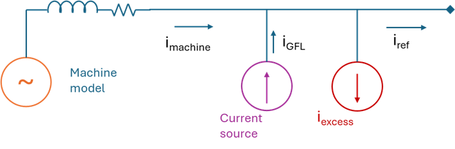
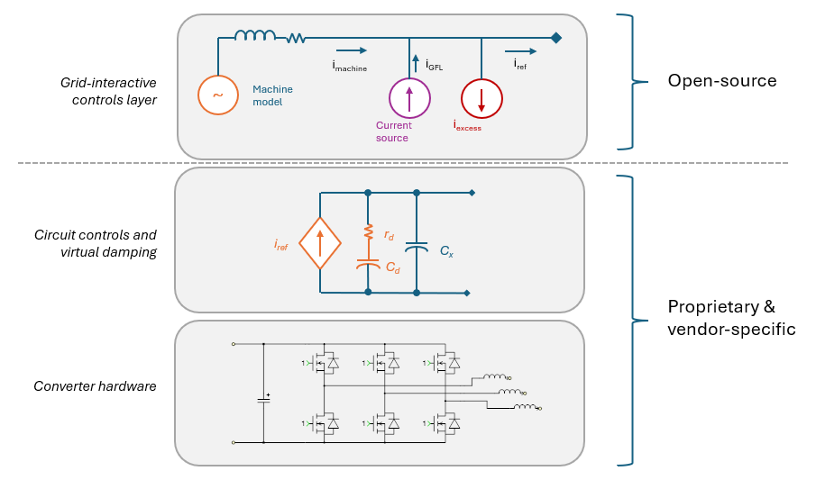
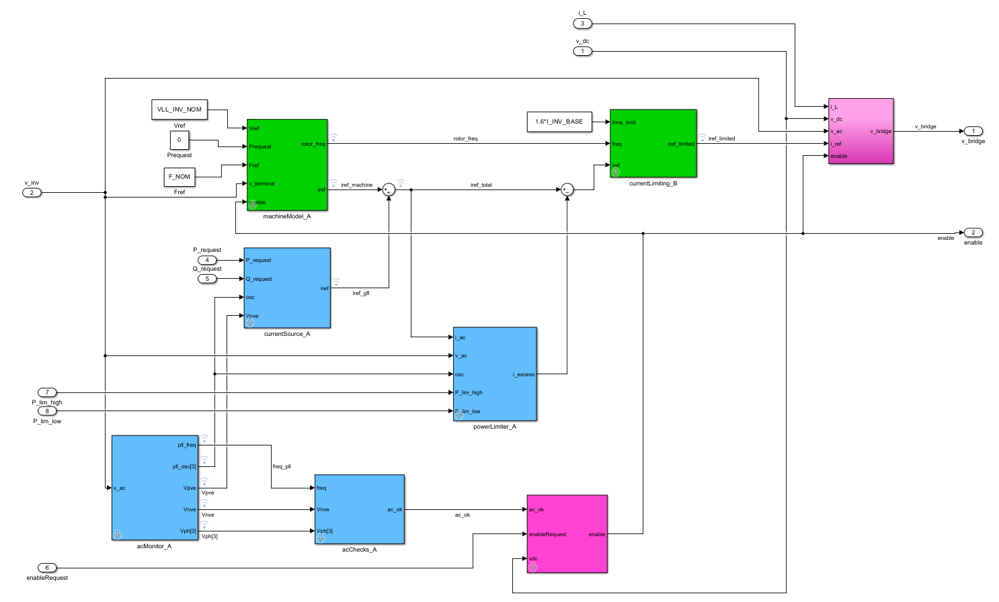
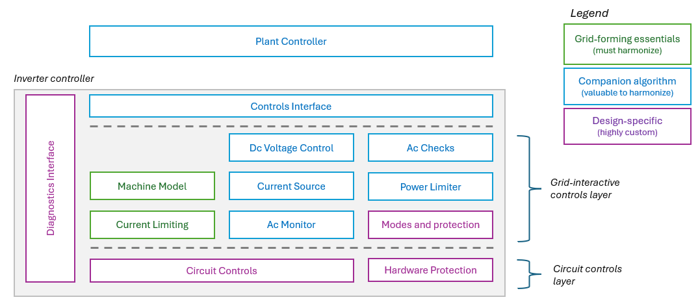
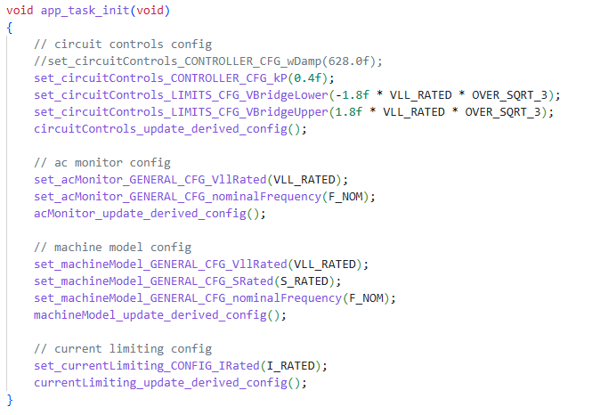
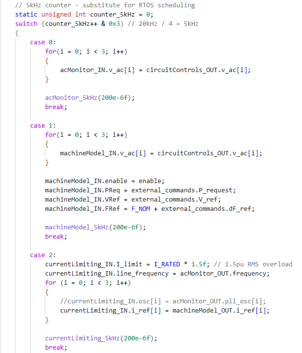

# Controller Integration Guide

This guide discusses the integration of grid-forming controls into battery & data-center power conversion systems, as well as PV inverters.  We address practical nuances related to meeting modern inverter specifications, and dig deeper into how OpenIBR controls elements can be compiled into an inverter's firmware stack.

## The Hybrid Architecture: A Pragmatic Approach

The machine model presented in this series of notes was kept intentionally simple.  It provides all the core dynamic stability behaviors required for scalable grid-forming, including power dispatch, frequency droop, and dynamic Volt/Var behaviors.  It provides a solid foundation and sufficient control hooks for supervisory plant controls.
From a practical perspective, we find that co-packaging the grid-forming machine model with a grid-following algorithm (as shown below) provides some tactical advantages.  The two algorithms are operated independently within the same controller, and their output current references are combined and handed to the circuit-controls layer for actuation.  Under this paradigm, the grid-following module responds to real and reactive power dispatch, while the grid-forming machine model creates a low-impedance voltage source characteristic complete with native inertial and droop behaviors.
 

**Figure 1** Hybrid controller architecture

This paradigm is not a must, but it does deliver several pragmatic advantages:
-	Provides a responsive dispatch path for real and reactive power,
-	It shields the machine model from unnecessary complexity required to navigate bespoke and fragmented requirements already addressed by the grid-following algorithm.  If & when these features become a commercial necessity, these can be carried forward by the grid-following algorithm, while keeping the machine model simple and clean,
-	The combined design remains fully grid-forming with all the benefits to power quality, grid-stability, and protection compatibility.

Additionally, a practical embodiment of the controller adds a power-sink for power limiting and a current-sink for RMS current limiting.  Adding these limiters as 'separate' virtual objects also shields the machine model from complexity, and allows for slowing-down limiting action to preserve machine sub-cycle dynamic behaviors.

### A Portable Approach

This grid-forming design represents the grid-interactive controls layer.  It is designed to generate low-level current references to be enforced by an underlying circuit controls layer that is specific to the hardware.  The grid-interactive layer dictates the external behaviors of the inverter, and its interface to the plant controller.   This layering approach means that this grid-forming controller can be applied to a wide variety of inverter hardware architectures such as traditional six-switch topologies, resonant topologies, multi-level bridge topologies, and modular structures based on solid-state-transformer (SST) technology.  That **circuit detail is abstracted away as a responsive controlled current source** underneath the grid-interactive layer.

**Figure 2** Controller abstraction concept

### Typical Application to a Grid-Forming Battery System

Battery systems are a natural host for grid-forming controls.  The controller setup for the hybrid architecture is shown below.  The core grid-forming algorithms are highlighted in green.  They are the machine model and the current-limiting algorithm outlined in [Part 1](./1_grid_forming_part1_reference_design.md) of this series.  The current source block is a ‘traditional’ grid-following (current-source) controller whose output is added to that of the machine model before current limiting is applied.  There are several other algorithms required for a functional inverter such as the power-limiter needed to enforce battery charge/discharge limits, ac-monitor, as well as ac-checks responsible for voltage & frequency tripping.

**Figure 3** Battery inverter controls structure

Note here that in this hybrid architecture, plant-controller dispatch signals (P_request, Q_request) are fed to the grid-following algorithm while the machine model power request is left at zero.  A valid alternative would be to omit the current-source altogether and opt for a purely machine-model based controller.  In that case, P_request would be fed into the machine-model, while reactive dispatch would be achieved by manipulating the voltage reference.  We recommend the hybrid approach. We find that it simplifies the system and addresses legacy requirement concerns as the industry makes the transition to grid-forming.

## Software Stack and Controls Layers

Within the layered structure described earlier, the library contains three categories of controls elements:
-	**Grid-forming essentials.**  This set of algorithms is the most important to capture and harmonize for interoperability.  They are:
    - Machine model: this captures the mechanical and electrical models that emulate synchronous machine behavior,
    - Current-limiting: this is a combination of peak- and RMS-current limiting that guide inverter behavior through faults.  This is considered a core algorithm because its design is crucial to maintain protection compatibility.
-	**Companion algorithms** needed to deliver a feature-complete controller.  Harmonizing this group of algorithms is very helpful to maximize interoperability but is not crucial.  They include:
    - Ac Monitor: this combines a phase-locked loop (PLL) and voltage phasor estimation algorithms,
    - Ac Checks: a set of voltage and frequency trips to qualify the grid and deactivate the inverter in case of an extended fault as typically required by grid-codes,
    - Current Source: this is an optional grid-following component in support of the hybrid controls architecture discussed earlier,
    - Power Limiter: this introduces a virtual power sink used to enforce power limits of the dc-source (e.g. battery charge & discharge power limits).
    - Dc-voltage Controls: this is primarily intended for PV inverters.  This algorithm generates power commands as the inverter follows the dc-voltage reference provided by the maximum power point tracking (MPPT) algorithm,
    - Controls interface: the data interface to the plant controller for dispatch purposes,
    - Plant controls: site-level controls algorithms to dispatch assets and comply with POI requirements.  As of now, plant controllers currently in the library *are intended as design examples ONLY*. The design of plant controls is a large topic, and will be addressed in a future installment of this series of notes.
-	**Design-specific algorithms** tied to the circuit design and OEM ecosystem.  This set of algorithms are likely to stay very custom.  They have little direct impact on interoperability as long as they meet a minimum performance expectation.  Examples are provided for use in the OpenIBR reference designs.  These include:
    - Circuit controls: this is the layer that actuates the hardware to follow the current references provided by the grid-interactive layer.  This circuit management layer generates the specific switching patterns necessary for the specific topology.  It must provide sufficient bandwidth and electrical damping to support stability at various line impedance levels,
    - Hardware protection: design-specific hardware protection functions.  This must be designed to avoid nuisance tripping and ensure ride-through grid-disturbances.  In other words, it must not get in the way of the grid-interactive layer for transient events within the desired operating space,
    - Modes and protection: this is stateful logic to deal with external enables, internal & external trips, retry mechanisms, and fault reporting.

**Figure 4** Controller elements and layers

## Library Structure
The library is designed with modularity in mind in pursuit of elegance and simplicity.  Power plants have a unique requirement: the interconnection process requires the design to be 'frozen'.  Once a design/model is approved and a plant is commissioned, changes to the control structure are discouraged and require scrutiny and sign-off by the interconnection authority.  To address this, we adopt a modular concept that allows for a methodical approach to maintaining backward compatibility.  The concept allows for preserving controls behaviors for commissioned plants while enabling evolution toward alternative design concepts for new sites.

Crucially, this super-modular approach allows the library to accommodate multiple grid-forming architectures.  While library elements are currently provided for grid-forming type C (WECC REGFM_C1), alternate elements can be provided to support types A & B as well.

### Elements and Schemas
In pursuit of modularity, algorithms are grouped up into modules, also referred to as 'controls elements'.  An element is a cohesive set of algorithms that achieve a specific function.  Examples are: the machine model, current-limiting, ac-checks, etc.  The public interface for each module is captured in a yaml schema file (see example [machine_model_A schema](../c_language_library/gfm_essentials/machine_model_A_schema.yaml)).  The schema file captures the following information:

- Metadata
    - Name and description of the module
    - Type: this will be used to differentiate multiple variants of an algorithm that have a very different interface (not backwards compatible).  For example, we might have multiple frequency-watt droop functions because some regions of the world require fancy dead-bands and hold functions.  We may also want to maintain the simpler cleaner version we prefer to use by default.  These flavors will be maintained as different 'types'.
    - Revision: this is to maintain backwards-compatible versions of the same type of element.  Backwards-compatible versions can only introduce (never remove) input/output/config signals that have a safe default if not set.
    - Format version: that's for managing evolution of the format of the yaml schema itself.  Essentially, this tells the script reading the yaml how to interpret this particular file.
- Signal groups of different 'use' types that capture the API of that element
    - input_group: these are the inputs that will be driven by other elements and will normally be continuously updated
    - output_group: these are the real time outputs to be consumed by other elements on a continuous basis
    - config_group(s): these are groups of configuration values normally written once at app initialization.. For example, this is where we capture controller tuning or configurable trip limits, etc
    - state_group(s): this is meant for status data.  They are often used to 'stage' data for exchange among the different task rates of the element itself (intra-module data exchange).  These are signals that other elements should NEVER depend on for operation, but are exposed to provide a better diagnostic picture of the element in real time. Examples of these are the estimated RMS current in the current limiter, or the timer values for grid-qualification, etc.
    - alert_group(s): these are Boolean alerts that indicate a 'significant event' such as a protection trip or other state-change.

For each signal within these groups, we capture information such as signal description, data type, and default value.

**Note**: you will notice '_A' (or other letter) appended to the names of algorithms both in the Simulink reference models and the c-language implementation.  This is the 'type' referred to above as part of the element's metadata.

### How are the schemas used?

These schemas are useful in many ways:

- **Auto-generated headers:** build scripts are used to convert these schemas to public and private c-language header files to go along with the implementation.  
The public headers are used to allow the app to interact with the element in a way that's compliant with the schema.  This facilitates a standardized way of initializing and interacting with the element.
The private header is used by the element itself, and includes static instances of the signals groups, initialized to the defaults.  This is actually an easier way to add/remove variables and have them be initialized and ready-to-go for use in the code.
- **Application map & structured signal names:** This element structure is meant to work in tandem with a reference model of the system (Simulink for controls) which provides a map of logic and data flow.  This can potentially be leveraged to allow the app layer to be auto-generated off of a description of input/output routing and relevant configuration.
This approach naturally creates a hierarchical structured name for a signal in the system based on the product, controller, and element it is part of.
- **Methodical data exposure:** without trying very hard, most data required to effectively localize and isolate bugs or trouble behaviors is captured in these signal groups.  Once an issue is localized to an element, it's still possible -likely infrequent- that other more detailed signal need to be 'temporarily' exposed to further troubleshoot, and that can also be conveniently done as part of a status signal group.  Furthermore, the natural grouping of data makes it possible to trigger 'targeted' high-frequency traces of a element based on alerts or event specifically related to it.
- **Alert management:** this structure can be directly tied into an alert management system
- **Configuration:** configuration/tuning parameters are grouped up by module, complete with documentation of what they mean which then facilitates the creation of a comprehensive settings management system.

**Note:** example Python-based auto-gen scripts are provided in the library in support of SiL and HiL examples.  When integrating the library into an inverter's firmware stack, these can be directly incorporated into the user's build system, or alternate auto-gen tools can be created to support the target's coding styles and standards - so long they use the same element interface definitions (captured in yaml files).

### Role of Simulink Unit Tests

Simulink unit tests serve as an enforcer for the requirements of the targeted element.  The test would fail if input, output, or configuration signals are removed or renamed.  Also, the unit test can be used to capture test sequences and pass/fail criteria for critical functionality of a given type of element.

# C-language Implementation

The c-language library is a straight-forward implementation of the controls elements captured in the reference controls library. Each of these is captured in a separate folder.  The elements are intentionally independent of each other.  The *.c files capturing the implementation utilize/include two groups of headers:

- Helper-library headers such as common types, macros, timers, and complex math.  These are found under the [helper_lib folder](../c_language_library/helper_lib/),
- Auto-generated headers.  These must be generated from the schema files before build, and whenever the schema files are modified.

## Simulink-based C-library Testing

Simulink is used as a test wrapper in two styles:
- Simulink-based unit tests: uses 'C Function' block to invoke a specific controls module
- Simulink-based software-in-the-loop (app runners): uses 'C Function' block to call an application in c-language that in-turn invokes multiple elements to make a more-complete inverter application

## Integrating Controls from the Library in Your Firmware Stack

### Before You Start!
**Review the License**: The project is licensed under the Apache License 2.0 (see [LICENSE](../LICENSE)). Be sure to read and understand its terms.

**You are in the driver seat when using the library.**  Do your validation. Stay vigilant.  Use your best judgement and industry best practices to get the results you are looking for.  We do our best to keep the design and implementation clean and correct.  However, it is ultimately your responsibility to spot issues or bugs in functionality you use and its interaction with your own stack.

### Integrating elements from the library
The library is designed for you to integrate controls elements into your own app, similar to the examples provided in Simulink SiL and the HiL example.  As you do so, please stick to the following paradigm to ensure a smooth experience as the library evolves:

- Incorporate header file auto-generation into your build process.  We provide example auto-generation scripts: 'generate_all_headers.py' python script in the [schema_tools folder](../schema_tools/).  You can use that as-is, or choose to develop your own to address specific coding rules or constraints in your system.
- In your initialization sequence, set the configuration parameter for each element you're using.  Follow that by calling its 'update_derived_config()' function to ensure these configurations ripple through.

    

- Each element has multiple task-rate functions, whose names are appended by the recommended call-rate (e.g. 5kHz, 1kHz, etc).  At each tick:
    - Populate all relevant inputs values (often from corresponding outputs from other elements),
    - Call the task-rate functions.

    
- To keep your code modular, healthy, and the element integration backwards compatible:
    - *NEVER* update any signal member that is NOT in an 'inputs_group' from outside the element!!
    - *NEVER* use any signal member that is NOT in an 'outputs_group' as an input to any other functional element or algorithm!
    - *RESTRICT* external use of 'status_group' and 'alerts_group' signals to read-only diagnostics and logging.
- Consider incorporating the unit tests provided in your build process to guard against functional issues or regressions.
- Please [file an issue in github](https://github.com/HeronPower/OpenIBR/issues) if:
    - You spot a bug or poor behavior
    - You identify an opportunity to simplify or otherwise improve the design
    - Have a request for a variant of an element
- Issues and feature requests submitted with strong justification will be triaged and addressed.  Requests will be evaluated with an eye on balancing functionality and simplicity, optionality and fragmentation.
- That's it!

## Summary

This note presents a guide for integrating grid-forming functionality into modern inverter controllers.  Grid-forming controls are part of a grid-interactive layer that lends itself to harmonization and sits on top of hardware-specific and OEM-specific circuit-controls.  The OpenIBR controls library is specifically designed to allow elements to be incorporated into different firmware stacks.  It leverages a clear schema-driven interface definition along with unit tests to guard its modular nature and simplify integration.
