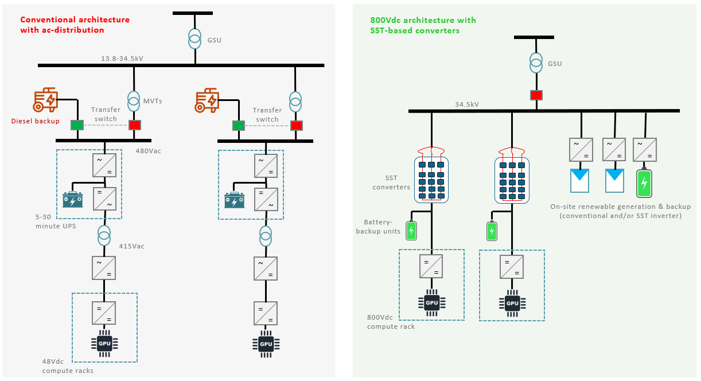
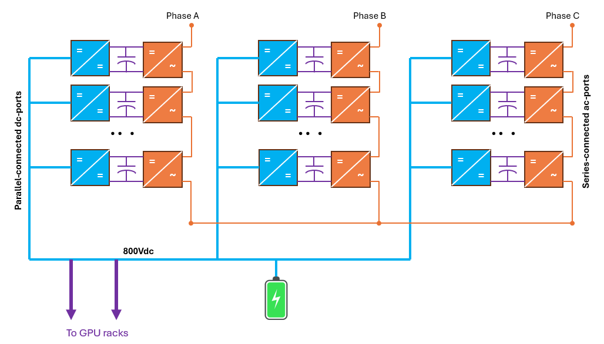
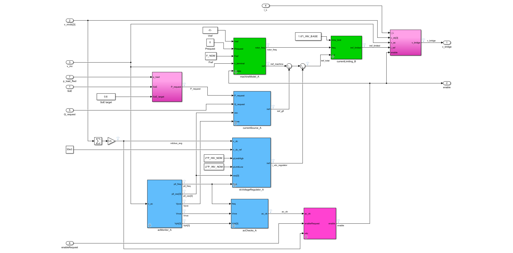
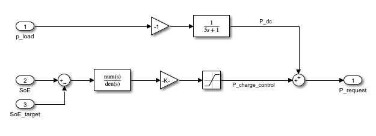

# Grid Forming Application to 800V SST-based Data Centers

In this note, we discuss the application of the OpenIBR grid-forming design to a modern 800Vdc data center.

In a conventional ac-distribution architecture, power is processed through many devices and conversion systems to reach the GPU racks.  A medium-voltage transformer (MVT) steps the medium voltage down to a low ac-voltage (typically 415V).  That is then fed into an uninterruptible power supply (UPS) that in turn supplies a separate low ac-voltage bus.  From there, rectifiers convert that to 48Vdc for use within the GPU rack.

The architecture presented here is a departure from the traditional ac-distribution architecture in several key aspects as shown in Figure 1:

- The 800Vdc distribution is supplied by a medium-voltage converter directly fed by a 35 kV MV circuit.  This converter is essentially a bidirectional inverter/rectifier that uses SST technology to eliminate the medium-voltage transformer (MVT) and absorb its functionality (voltage step & isolation).
- A Battery-Backup Unit (BBU) directly hangs off that 800Vdc bus and provides a natural energy buffer decoupling grid and load dynamics.

**Figure 1** Large load architectures: (a) conventional with ac-distribution and (b) 800Vdc with SST-based converters

This architecture solves two fundamental large-load interconnection challenges.  The BBU naturally supplies and shunts load-driven power fluctuations (GPU power ripple).  Simultaneously, the SST-based converter can leverage BBU energy to present full grid-forming functionality to the grid.  Going far beyond simple ride-through, the large load deployment actively promotes grid stability with a cohesive set of inertial response, damping, voltage strength, and coherent fault currents. 

This note leans on the OpenIBR grid-forming design for the underlying tuning derivations. Here we discuss the SST-based converter and the controls implications of operating a grid-forming asset that consumes power rather than generates it.

## Ac/Dc Conversion with Solid-State Transformer Technology

SSTs are devices designed to interface with medium voltage by leveraging a modular structure employing many converter 'cells' in series.  In this case, the SST-based converter is built on an input-series output-parallel architecture of identical, isolated power cells. On the ac side, each phase is formed by a string of N cells whose ac terminals are connected in series, so the individual cell voltages add up to the full medium-voltage phase voltage. This lets each cell operate at 1/N of the phase voltage while the series string as a whole withstands the 34.5 kV connection.  Together, the three phase strings synthesize the three-phase sinusoidal waveform at the MV terminal and control ac-current. Each cell has a dc-dc converter with a high-frequency isolation transformer that provides galvanic isolation between the ac-side and dc-side of the stages. On the dc side, the outputs of all cells are connected in parallel onto a common bus, summing their currents to build the 800 Vdc output that is distributed to supply data center racks.

**Figure 2** SST-based Converter Architecture

## Grid-Forming Load Control Structure

This SST-based converter can simply utilize the OpenIBR-based grid-interactive design for a battery inverter with power dispatch now originating from a BBU charge controller as shown in Figure 3 below.  As a result, it also inherits the tuning recommendations for a battery plant.

**Figure 3** Grid-forming SST-based rectifier controls structure

**Figure 4** BBU Charge Controller

To the bulk system, the SST-based converter looks like a well-behaved synchronous motor that presents the characteristics of a voltage source behind an impedance.  It can also be thought of as a grid-forming battery system that is constantly charging (in steady-state).  The machine model operates as a synchronous condenser, and carries no net power in steady-state. The power draw from the grid is represented by the current source, which is controlled by the BBU charge controller. The converter is thus controlled to absorb the average load power from the grid, while high-frequency transients are handled directly by the battery unit, which also stabilizes the dc-bus.

During transients on the ac side such as faults, phase jumps, or rapid frequency excursions, the machine model provides a transient power response to promote stability. The BBU supplies or absorbs this deviation from load power draw. This is genuine inertial and damping response: the energy comes from dc storage, and the SST-based converter momentarily injects into or further absorbs from the grid in opposition to the disturbance - just as a synchronous machine would release or absorb kinetic energy. When the transient subsides, the machine model power returns to zero and the system returns to the power level commanded by the BBU Charge Controller.

The energy required to achieve grid-forming dynamics is less than 1 second.  It is a negligible fraction of the energy required to smoothen load transients and provide temporary backup.  It therefore does not impose added cost to the BBU.

**Note:** this transient support is distinct from demand-side response or load curtailment. The SST converter is not just throttling its consumption, but is presenting a low-impedance voltage source that responds to grid dynamics within a line cycle, sourcing natural fault currents and inertial power from stored energy. The steady-state operating point is unchanged and is immediately recovered as the disturbance subsides.

## Summary

Data centers have the necessary ingredients to become fully grid-forming assets.  Driven by increasing compute density and power requirements, reference data center designs are guiding toward an 800Vdc distribution architecture.  That dc-bus is a natural integration point for a battery-backup unit intended to (a) filter GPU power fluctuations and (b) provide energy to navigate grid disturbances.

Leveraging OpenIBR and a negligible fraction of the BBU energy, the data center can present fully grid-forming behavior to the power grid, indistinguishable from a grid-forming battery or a synchronous motor.  This grants the data center predictable and stabilizing dynamics and provides comprehensive behaviors that address dynamic grid-interconnection challenges.  Moreover, it simplifies the introduction of additional on-site inverter-based assets such as grid-forming batteries and PV.
