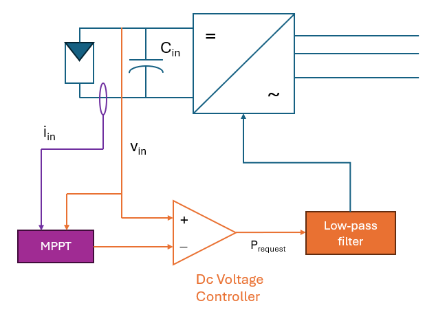
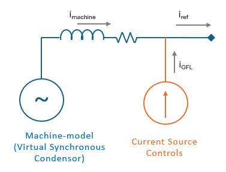
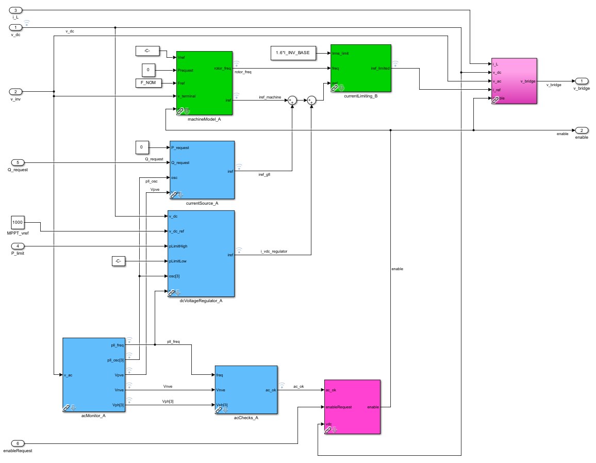
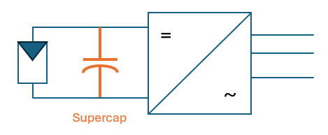

# Grid Forming PV

So how does grid-forming apply to PV?  The answer really depends on how the basic challenge of limited stored energy is tackled.  PV inverter designs are optimized for cost, and therefore have only a small capacitance stabilizing the dc-bus.  A typical design has several milliseconds of usable energy available.  This leaves two main avenues to design a grid-forming PV inverter:

- Focus on delivering partial grid-forming benefits afforded by the limited energy available,
- OR add a short-term energy buffer capable of supporting a comprehensive set of dynamic responses.

This guide presents both approaches.  First, we outline the stored energy required for a grid-forming inverter to navigate transients based on its tuning.  We then discuss both design options and their performance implications in that light.

## Background: Dc-Voltage Control and Capacitor Sizing
PV inverters are controlled with Maximum Power Point Tracking (MPPT) algorithms to maximize power output during normal conditions.  This is an essential function necessary to support the financial feasibility of such projects.  This is typically achieved by using a dc-voltage controller as shown in Figure 1 below.  This is a feedback controller that dynamically modifies the power request to underlying controls to bring the PV array voltage to the reference provided by the MPPT controller.  The bandwidth of this loop must be tuned based on the energy stored in that capacitor.

**Figure 1** Dc-voltage controls for a single-stage PV inverter

A typical PV inverter, optimized for cost, offers just the minimal capacitance required to achieve stable dc-voltage control.  The bandwidth of the dc-voltage controller is kept relatively high, often approaching 1 kHz.  This means that inverter power flow stays tightly controlled and non-responsive to grid transients.  It can be thought of as 'prioritizing' dc-voltage stability over grid-stability.

## Grid-Forming PV Inverter Control Structure

A grid-forming PV inverter must be responsive to grid transients, allowing power to fluctuate during grid transients.  The basic design is simple and follows the hybrid controls architecture presented in the [controller integration guide](4_controller_integration_guide.md).  The machine model can be operated as a synchronous condenser (with zero mechanical power), granting the inverter that stabilizing voltage-source-behind-impedance characteristic.  It parallels the current-source which acts as a traditional PV inverter.

**Figure 2** Grid-forming PV Concept

The controls structure for a grid-forming PV inverter is shown in the figure below.  The structure is quite similar to that of the grid-forming battery, with a couple of notable differences.  The power request is generated by a dc-voltage controller, which is handed a dc-voltage reference from the MPPT algorithm (not shown here).  That power request is processed by the grid-following current-source.  The machine model is configured with zero steady-state droop gain and acts as a synchronous condenser.  Dc-voltage protection is added to temporarily trip the unit if the dc-voltage collapses or swells uncontrollably during harsh transients - a possibility that must be minimized by careful tuning OR an added energy buffer.

**Figure 3** PV inverter controls structure

### So How Much Stored Energy is Required to Navigate Grid Transients?

The energy required is highly dependent on the tuning of the machine model, presented here based on the OpenIBR tuning framework.

For a phase jump:

$$ \Delta P = \frac{sin(\Delta \Theta)}{X_{total}} $$

With critical damping, power is expected to decay and cross zero in 4 cycles of the resonant frequency, or $4/\omega_r$

$$ \Delta E_{swing} = \frac{2 \cdot sin(\Delta \Theta)}{\omega_r \cdot X_{total}} $$

For a frequency change, the rotor model contributes two components of energy:

$$ \Delta E_{damper} = {\tau}_{damp} \cdot D \cdot \Delta f $$

and

$$ \Delta E_{inertia} = \frac {2 \cdot H}{F_{nom}} \cdot \Delta f $$

For an extended resistive fault or overload, the inverter needs to contribute real power to continue to supply fault current.  Worst-case power delivery occurs for a resistive load at the POI, equal in magnitude to the total reactance:

$$ r_{fault} = X_{total} $$

$$ P_{fault} = \frac{1}{2 \cdot X_{total}} $$

This translates to a fault energy of:

$$ E_{fault} = \frac{T_{fault}}{2 \cdot X_{total}} $$

The hybrid controls architecture presented above provides a convenient design choice to minimize (not eliminate) the chances of this happening.  The machine model algorithm can be intentionally tuned with low inertia, lower damping, and potentially higher impedance to reduce the energy moved through a transient.  This presents a convenient tradeoff between the capacitance required and the strength of grid-forming function.

Let's now calculate specific numbers with two designs in mind:

- A low-inertia design intended to minimize energy requirements,
- AND a design with a full-sized machine (same as battery application, but with zero power droop gain).

| Parameter                              | Symbol               | Value with low-inertia  | Universal tuning (same as BESS) |
|----------------------------------------|----------------------|-------------------------|---------------------------------|
| Total impedance                        | $X_{total}$          | 0.5 pu                  | 0.5 pu                          |
| Inertia                                | $H$                  | 0.2 sec                 | 2.5 sec                         |
| Damping                                | $D$                  | 0.5                     | 2.0                             |
| Droop gain                             | $k_{droop}$          | 0                       | 0                               |
| Phase shift energy                     | $\Delta E_{phase}$   | 0.038 sec               | 0.13 sec                        |
| Damper energy for frequency movement   | $\Delta E_{damper}$  | 0.15 sec                | 0.75 sec                        |
| Inertia energy for frequency movement  | $\Delta E_{inertia}$ | 0.067 sec               | 0.0833 sec                      |

**Note:** energy values are shown in seconds due to energy calculation in per-unit.  Multiply by inverter apparent power rating to calculate in Joules.

Energy calculations in the table show that even with a low-inertia design, energy required for strong transients goes well beyond that available in a conventional design.  However, a low-inertia design can still provide partial benefits so long as the system planner is aware of its limitations.

For a full-inertia design with universal tuning, a significant energy buffer must be made available.  In fact, it is quite feasible to achieve that using a supercapacitor directly tied at the dc-bus.  This effectively combines a grid-forming STATCOM function into the PV inverter at a fraction of the total cost.

## Grid-Forming PV with Limited Stored Energy - A Pragmatic Approach

With limited stored energy, a grid-forming PV can still deliver many advantages over a traditional grid-following design.  These are limited to steady-state behaviors and the initial electrical stage of a grid-transient recovery.  It also has some functional limitations in subsequent transient stages of recovery (inertial and beyond).  These limitations can be addressed with proper system planning process.

Functionality provided by a grid-forming PV inverter:
-	Voltage-behind-impedance characteristic delivers voltage harmonic stabilization, voltage balance, and reduced fluctuations,
-	Ability to connect to weak areas of the grid, and interoperate more seamlessly with adjacent generation,
-	Ability to perform black-start functionality, critical for system restoration following a black-out,
-	Predictable behaviors, including fault currents required for protection coordination,
-   Provide grid-strength and limit phase jumps during electrical stage of fault recovery (stage 1).

This low dc-capacitor design also has some key limitations:
-   May trip due to larger phase jumps,
-   Provides little inertia and damping, allowing the dc-bus controller to counter the machine model's contribution,
-   Does not tolerate and will trip due to close-by & extended resistive faults - a limitation that is surmountable with tight protection coordination.

**Note:** The [GFM PV design](../simulink_reference_models/gfm_pv.slx) provided in this library does exhibit tripping under particularly challenging transient test cases.

## Grid-Forming PV with a Supercapacitor - A Comprehensive Solution

In the pursuit of a more universal design that simplifies system planning and protection coordination, we find a lot of value in exploring an upgraded design that employs a supercapacitor to provide extended energy.  This 'PV-plus' design allows grid-forming PV to match the tuning and transient behavior of a grid-forming battery system, and comply with dynamic requirements such as ERCOT's AGS-ESR.

**Figure 4** The PV-plus concept: adding a supercapacitor to support grid-forming functions

In this design, a supercapacitor is added directly across the dc-bus. The machine model can draw transient energy from this supercapacitor and deposit transient energy into it without driving the dc-bus voltage outside its normal range.  The usable energy in this capacitor depends on the maximum dc-voltage swing the system can tolerate during a transient:

$$ E_{usable} = C \cdot \Delta V \cdot V_{nom} $$

Considering even the extreme case driven by an extended resistive fault, the energy required remains well below 1 second.  The cost of this supercapacitor is expected to be a fraction of the inverter's cost, and a tiny fraction of the overall PV plant cost.  This is an attractive option that effectively absorbs the functionality of a STATCOM at a marginal cost.

# Summary

Applying grid-forming controls to PV inverters requires special attention owing to the limited amount of energy available to contribute to grid stability.  This energy limitation can either be tolerated by de-tuning the machine model and limiting functionality, or alternatively addressed by adding a larger energy buffer.  The implications of this choice are summarized below:

Functionality           |   Grid-following PV     |           Grid-forming PV (low-energy design)     |         Grid-forming PV-plus (with supercapacitor)        |
------------------------|-------------------------|---------------------------------------------------|-----------------------------------------------------------|
Weak grid stability     |   Challenging           |        Yes                                        |         Yes                                               |
Harmonics damping       |   Add-on feature        |        Yes                                        |         Yes                                               |
Voltage balance         |   No                    |        Yes                                        |         Yes                                               |
Coherent fault currents |   No                    |        Yes                                        |         Yes                                               |
Dampen phase-jumps      |   No                    |        Within limits, may trip                    |         Yes                                               |
Inertial contribution   |   No                    |        Limited (countered by dc-controller)       |         Yes                                               |
Frequency damping       |   No                    |        Limited (countered by dc-controller)       |         Yes                                               |
Blackstart              |   No                    |        Yes                                        |         Yes                                               |
Intuitive & predictable |   No                    |        Yes                                        |         Yes                                               |

We believe grid-forming functionality — even the limited version — adds significant benefits to the system.  For simplified system planning and improved resilience, the PV-plus paradigm that employs an additional energy buffer is quite attractive despite the added cost.
