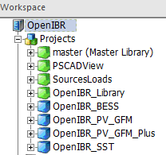
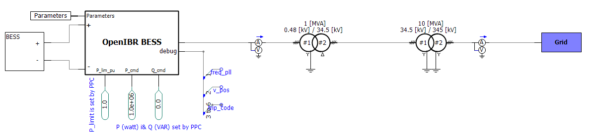
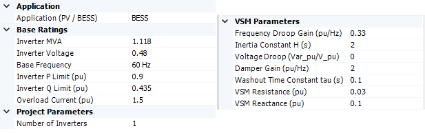

# OpenIBR PSCAD Model — Application Note

## 1. Introduction

The OpenIBR PSCAD models have been developed to familiarize the user with the dynamic performance of OpenIBR-based grid-forming controls in a PSCAD simulation environment. Individual models have been developed to represent each of the four OpenIBR use cases:

| Use Case | Project | Inverter Platform | DC-Side Representation | Application Note Reference |
|---|---|---|---|---|
| BESS | `OpenIBR_BESS` | 480 V | Battery energy storage | Reference Design |
| PV | `OpenIBR_PV_GFM` | 480 V | PV inverter | PV Application Note |
| PV+ | `OpenIBR_PV_GFM_Plus` | 480 V | PV+ inverter | PV Application Note |
| SST | `OpenIBR_SST` | 34.5 kV output | 800 V DC data center load | 800V Data Center / SST |

The BESS, PV, and PV+ models are built on the 480 V inverter platform, whereas the SST model is built on the 34.5 kV output platform. The inverters are represented as averaged source models. Switching-frequency dynamics are not simulated, and the models are suitable for control-loop and system-level dynamic studies at time steps up to 25 µs.

All control structures used in the PSCAD models are open-box. Every block of the OpenIBR control architecture, including synchronization, inertial and damping response, voltage regulation, and current limiting, is visible and traceable to the actual logic block. No compiled black-box modules are used, consistent with the OpenIBR objective of controls transparency.

## 2. Model Files and Libraries

Figure 1 shows the files and libraries developed for OpenIBR. The models are distributed as a single PSCAD workspace containing one project per use case, supported by a set of shared libraries.

**Figure 1. OpenIBR PSCAD workspace: model files and libraries.**

| Project | Description |
|---|---|
| `HeronLink_Lib` | Shared OpenIBR inverter and control component library |
| `OpenIBR_BESS` | BESS use case (480 V platform) |
| `OpenIBR_PV_GFM` | PV use case (480 V platform) |
| `OpenIBR_PV_GFM_Plus` | PV+ (supercapacitor-augmented) use case (480 V platform) |
| `OpenIBR_SST` | Data center SST use case (34.5 kV output platform) |

**Software requirements:**

- PSCAD 5.0.1 or later
- Recommended solution time step: up to 25 µs

## 3. Scope of the Models

The use-case projects include the inverter models, transformers, and the grid. The plant power controller (PPC) is not represented within the inverter models themselves. For plant-level evaluation, any external PPC model of the user's choosing can be added to the simulation. The active and reactive power commands from the PPC should be wired to the inverter input terminals P_cmd and Q_cmd, in watts and vars, respectively.

For the data center SST model, P_cmd is not used, since the active power draw is determined by the load connected to the 800 V DC side. The inverter regulates the DC bus, and the AC side active power follows the DC load through the BESS-equivalent control structure described in [Part 5](./5_grid_forming_800Vdc_data_center_application.md). The Q_cmd input remains active and can be set to the desired reactive power output of the inverter.

## 4. Example: BESS Model

Figure 2 shows the example of the BESS model.

**Figure 2. OpenIBR BESS model.**

The inverter dynamic performance can be tuned based on the exposed parameters shown in Figure 3. The inverter parametrization has been set up based on the tuning methodology of the Design and Tuning Guide. In particular, the inertia constant, damping, and washout filter settings follow the guidance developed there.

**Figure 3. Inverter parameter dialog.**
