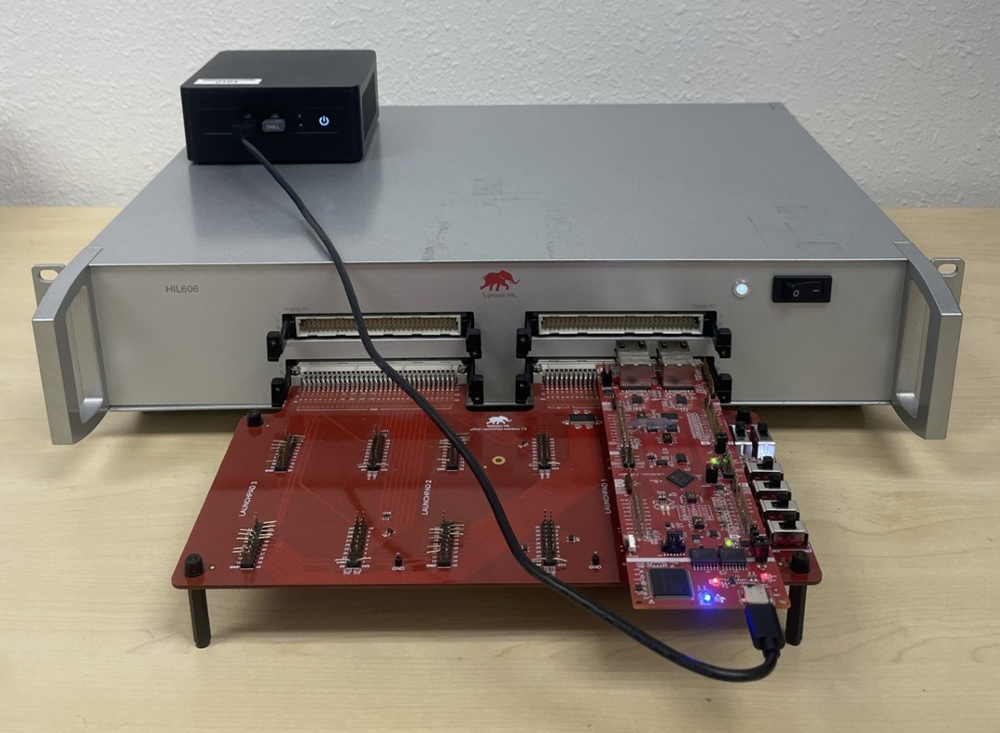
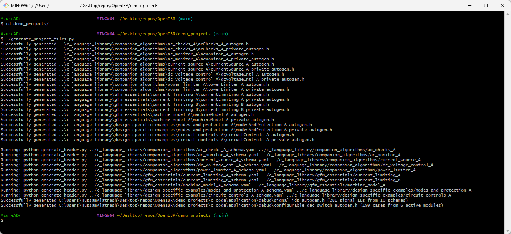
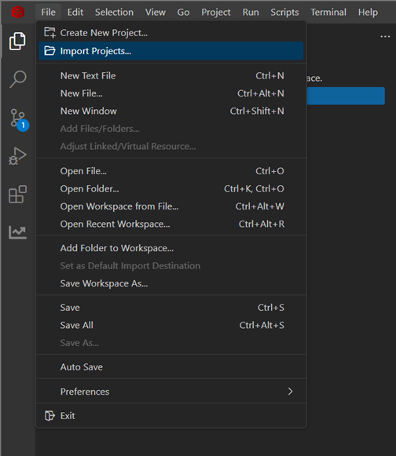
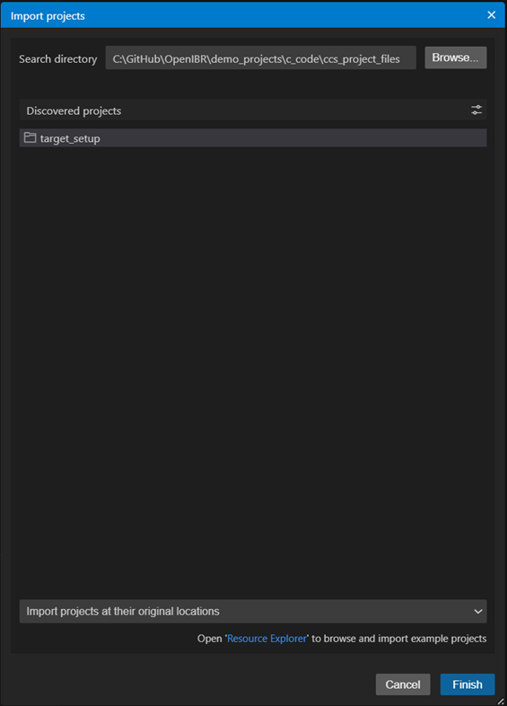
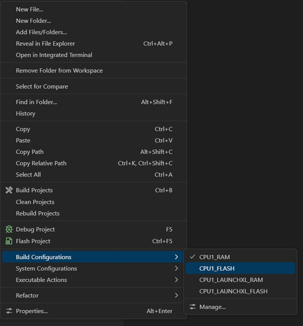
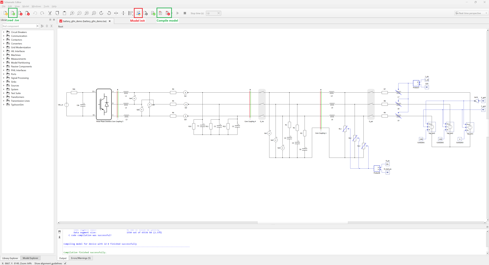
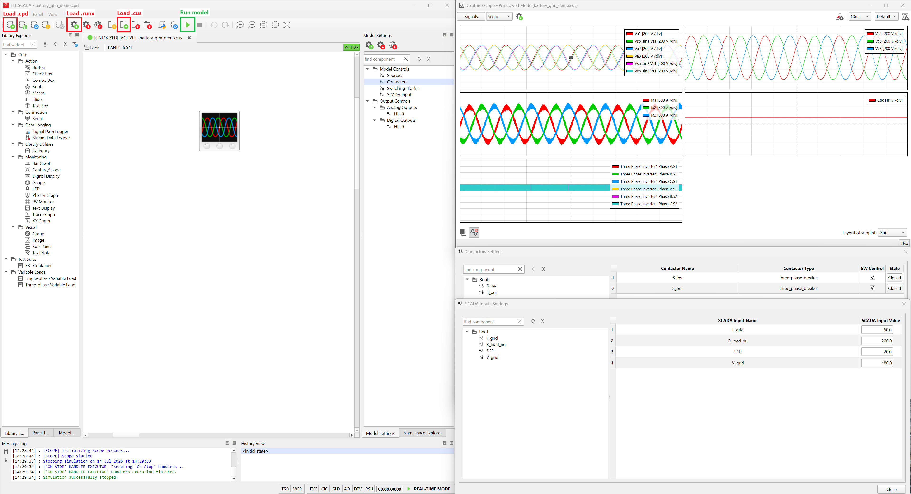
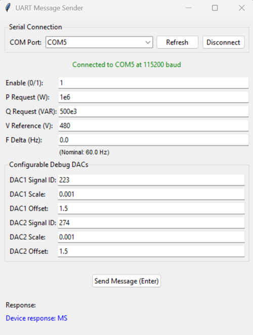
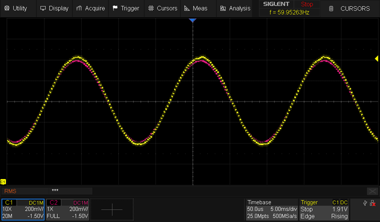

# Using the HiL Project

This guide walks through running the OpenIBR demo project on hardware-in-the-loop.

## 1. Hardware Setup

**Required hardware:**
- [Typhoon HiL606](https://www.typhoon-hil.com/products/hil-simulator/hil606/) (or simpler Typhoon HiLs will work too)
- [F28P65 LaunchPad](https://www.ti.com/tool/LAUNCHXL-F28P65X) (C2000 F28P65x)
- [uGrid LaunchPad interface](https://www.typhoon-hil.com/documentation/typhoon-hil-hardware-manual/hil_ti_ugrid_launchpad_interface/topics/abstract.html) (or any compatible interface)





## 2. Dependencies

- **Python** — Python 3.10+ with [uv](https://docs.astral.sh/uv/) installed. The codegen scripts (header autogen, signal ID list, configurable DAC) need `PyYAML`, and the UART sender / GUI scripts need `pyserial` (`tkinter` for the GUI is part of the Python standard library). Running the scripts through `uv run` handles this for you.
- **Code Composer Studio** — [CCS 20.4.0](https://www.ti.com/tool/download/CCSTUDIO/20.4.0)
- **C2000Ware** — [C2000Ware_5_04_00_00](https://www.ti.com/tool/download/C2000WARE/5.04.00.00)

## 3. Building the Embedded Project

In order to compile the project, generate all required headers and signal IDs.  From the 'demo_projects' folder, run:

```bash
./generate_project_files.py
```




This runs the complete code generation pipeline:
- Generates `*_autogen.h` headers from YAML schemas in `c_language_library/**/*_schema.yaml` (module structs, defaults, etc.)
- Generates `signal_ids_autogen.h` with signal IDs for the configurable debug DAC
- Generates `configurable_dac_switch_autogen.h` for live signal routing to DAC outputs

Re-run this whenever a schema changes or you add new global state variables for observability.

Next, import the CCS project: in Code Composer Studio, go to **File → Import Projects...**:



Point the search directory at `demo_projects/c_code/ccs_project_files` — CCS will discover the `target_setup` project. Select it and click **Finish**:



Finally, right-click the project, pick your build configuration under **Build Configurations** (e.g. `CPU1_FLASH` to boot from flash), then use **Flash Project** to build and flash the Launchpad:



## 4. Launchpad Setup

Before running the demo, configure the hardware switches and jumpers on your launchpad as described below.

### Typhoon uGrid Interface Board

The BOOT1, BOOT2, XRSn1, and XRSn2 pins are exposed on the uGrid interface board and driven to a particular state by Typhoon. We recommend **folding the interface board pins to avoid driving those pins to an incorrect state** during setup.

### F28P65 LaunchPad

- **S2 switch** — Position in **00** to enable serial communication through the USB interface
- **S3 switch** — Position in **11** to boot from flash
- **J15 jumper** — **Connected** to use the externally generated 3V0 ADC reference

## 5. Typhoon Setup

The demo model is a BESS inverter with a 1.1kV DC input and 480V 3-phase AC output feeding a simple plant.

- Open the Typhoon schematic to see the power stage, compile the schematic and load it to the HiL box.



- Open Typhoon SCADA and load the model files inside `demo_projects/typhoon_hil`.  Load the 'run configuration' (.runx) file.  Use 'Model Controls' to control the simulation.



## 6. Using the GUI to Command the Controller

To launch the GUI, navigate to the `demo_projects` directory and run:

```bash
./uart_sender_gui.py
```

The GUI talks to the Launchpad over UART and lets you command PQVF setpoints:



### Configurable Debug DAC

The element schema (yaml files) structure were used to generate a convenient debug interface.  You can route any internal signal captured in the schema to a DAC output for viewing on a scope. Every signal in the compiled modules gets an ID in `signal_ids_autogen.h` (generated by `generate_project_files.py`):

```c
#define SIGNAL_ID_AC_CHECKS_IN_FREQ 0
#define SIGNAL_ID_AC_CHECKS_IN_VPH0 1
#define SIGNAL_ID_AC_CHECKS_IN_VPH1 2
...
```

- Pick a signal from the signal list in `signal_ids_autogen.h`.
- Enter the numeric ID in the GUI, set the DAC scaling and offset.  This outputs the values in real time on the DAC output pins on the Launchpad.
- The DAC outputs (DACA and DACC) can be probed directly with a scope.



