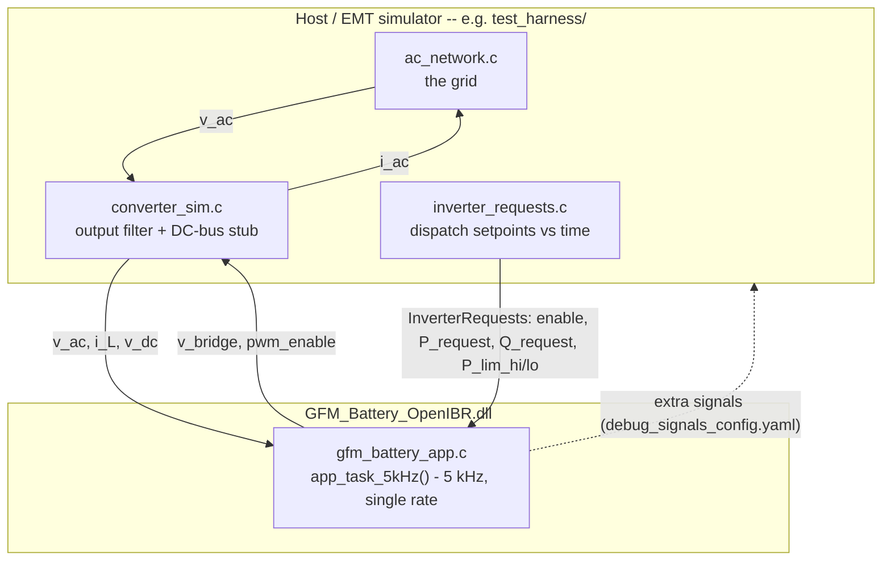
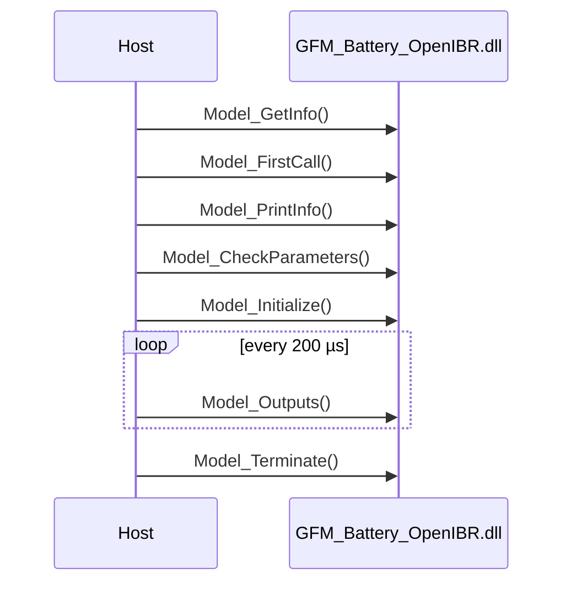

# OpenIBR IEEE/CIGRE Real-Code DLL — Application Note

## 1. Introduction

The `ieee_cigre_dll/` folder contains the setup necessary to package the an OpenIBR inverter controller as a compiled DLL that conforms to the CIGRE Technical Brochure 958 (JWG CIGRE B4.82/IEEE, Feb 2025) "real-code" interface — the same DLL-import convention supported by various EMT/RMS simulation tools including PSCAD. A simulator that implements a TB958 DLL Import tool can load the DLL directly and run the actual OpenIBR control code inside its own study, rather than a re-implementation of it.

A grid-forming battery inverter is used as an exmaple, configured to generate `GFM_Battery_OpenIBR.dll`.  It compiles elements form the `c_language_library/` similar to the Simulink Software-in-the-Loop (`simulink_sil/`) and the controller-hardware-in-the-loop (CHiL) demo projects described elsewhere in this documentation set. This DLL is independent of both; each is a separate application built on the same underlying elements.

This note covers what crosses the DLL boundary and how the simulation advances in time, the code layout and how to build it, and how multi-instance simulation and snapshot/restart can be handled — entirely outside the DLL itself.

## 2. How It Works

### 2.1 What's inside the DLL vs. what's on the host

The DLL is setup to capture the controller *only*. Models of the inverter circuit and of the AC network are provided by the host runner. To validate the DLL, this repo includes a simple test haress, `test_harness/`, that includes:
 -  a grid-simulation: `ac_network.c`,
 -  inverter circuit simulation: `converter_sim.c`,
 -  dispatch setpoints over time `inverter_requests.c`.

The DLL performs no file I/O.  Any recording or logging is entirely the host's responsibility.  The test-harness in this example writes to a COMTRADE file.



### 2.2 Signals crossing the boundary

In simulation time, the DLL must be iteratively called with electrical 'measurements' from the host simulation, in addition to the dispatch quantities representing plant controller requests.  It returns the bridge voltage produced by the inverter, and an indication whether the inverters remains enabled or not.  Additionally, the DLL is setup to provide 'debug' signals for logging as described later below.

| Direction | Signal(s) | Unit | Meaning |
|---|---|---|---|
| In (electrical feedback) | `v_ac[3]` | V | 3-phase AC terminal voltage |
| In (electrical feedback) | `i_L[3]` | A | Measured converter output (inductor) current |
| In (electrical feedback) | `v_dc` | V | DC bus voltage |
| In (dispatch) | `enable` | bool | Controller enable gate |
| In (dispatch) | `P_request` | W | Active power dispatch request |
| In (dispatch) | `Q_request` | VAr | Reactive power dispatch request |
| In (dispatch) | `P_lim_high` / `P_lim_low` | W | Active power limits |
| Out | `v_bridge[3]` | V | Commanded 3-phase bridge voltage |
| Out | `pwm_enable` | bool | PWM/bridge enable gate |
| Out (optional debug) | whatever `debug_signals_config.yaml` lists | — | Internal signals exposed as extra output ports for troubleshooting |

### 2.3 Simulation time-steps

The DLL itself is single-rate: it declares (and must be called at) a fixed 200 µs / 5 kHz step — the same rate the real embedded firmware runs at. There is no multi-rate logic inside the DLL at all.

Time step of the host simulation must be smaller or equal to that of the DLL.  The test-harness network and converter models need a much finer step to resolve their own fast dynamics accurately, so `test_harness.c`'s main loop runs at the DLL's 5 kHz rate on the outside and performs `MODEL_SUBSTEPS` (16) fine 80 kHz network/converter steps inside each iteration:

```c
for (/* 5 kHz app cycles */)
{
    for (/* 16 fine 80 kHz model substeps */)
    {
        ac_network_step(...);
        converter_sim_step(...);   // uses whatever v_bridge the DLL last produced
        if (/* first model substep of this cycle */)
        {
            Model_Outputs(...);    // produces a fresh v_bridge, used immediately below
        }
    }
}
```

### 2.4 Exported functions

A host talks to the DLL through exactly eight `extern "C"` entry points, defined by CIGRE TB958. Two are one-time setup calls, one is the loop that actually runs the controller, and the rest exist because the interface expects them.



| Function | Called | What it does here |
|---|---|---|
| `Model_GetInfo` | once, first | Returns a pointer to a static struct: name/version, the 5 kHz fixed step, the 8 input / 2+N output ports, and 3 exposed control parameters. |
| `Model_FirstCall` | once, before init | No-op — no malloc, license check, or DLL-load needs. |
| `Model_PrintInfo` | once, before init | Writes two identity lines to the host's log. |
| `Model_CheckParameters` | once, before init | Validates each exposed parameter (`H`, `D`, `kDroop`) against its declared min/max. |
| `Model_Initialize` | once per instance | Configures all six controller modules and the current controller from the host's exposed parameter values. |
| `Model_Outputs` | every 200 µs | The real work — reads `v_ac`/`i_L`/`v_dc`/dispatch inputs, writes `v_bridge`/`pwm_enable`. |
| `Model_Iterate` | RMS only (unused here) | No-op. TB958 documents this as RMS-only sub-iteration between `Model_Outputs` calls, "reserved for future use" — this project's harness is EMT-only and never calls it. |
| `Model_Terminate` | once, at teardown | No-op — nothing is heap-allocated in this single-instance build. |

The three host-configurable `Parameters` — inertia (`H`), damping (`D`), and active-power droop (`kDroop`) — are the DLL's real TB958 `Parameters` (range-checked in `Model_CheckParameters`, applied in `Model_Initialize`). Everything else about the controller's tuning is compiled in; see [Configuration tiers](#33-configuration-tiers) below.

## 3. Code Structure and How to Compile

### 3.1 The DLL itself

| Path | What it is |
|---|---|
| `gfm_battery_dll.c` | The 8 IEEE/CIGRE entry points (`Model_*`) |
| `gfm_battery_app.c` / `.h` | Orchestration layer wiring the 6 controller modules together |
| `IEEE_Cigre_DLLInterface*.h` | Interface structs/enums, verified against CIGRE TB958 |
| `GFM_Battery_OpenIBR.def` | MinGW linker export list |
| `debug_signals_config.yaml` | Internal signals to expose as extra output ports (edit + rebuild) |
| `dll_config.yaml` | Compiled-in advanced `circuitControls` gains + exposed-parameter defaults (edit + rebuild) |
| `logging/` | Codegen that builds the extra output ports |
| `generate_dll_config.py` | Generates `dll_config_generated.h` from `dll_config.yaml` |
| `Makefile` | Builds both the DLL and `test_harness/` below |

The controller profile is defined by `gfm_battery_app.c`, pulling in elements from `c_language_library/` that is shared with the rest of the repo.  This is packaged up using `gfm_battery_dll.c` which implements the functions required to be exported by the DLL.

### 3.2 Configuration tiers

Configuration is split into three tiers, matching how a real integration wants to treat each kind of value:

- **Ratings and fixed hardware limits** (`VllRated`, `SRated`, `FNom`, and the RMS current limit `ILimit`, pu of `IRated`) don't change for a given physical unit — plain compiled-in constants in `gfm_battery_app.h`.
- **Advanced parameters** — the 7 current-controller tuning gains (`wDamp`, `gDamp`, `kFeedFwd`, `kP`, `kSlowPath`, `wSlowPath`, `wOffsetCalibration`) — are also compiled in, not exposed as TB958 `Parameters`, but sourced from `dll_config.yaml` (`advanced_parameters.circuitControls`) so an advanced integrator who compiles their own DLL has one place to find and edit them.
- **3 exposed parameters** — `H`, `D`, `kDroop` — are the DLL's real, host-configurable `Parameters`, defaulting to `dll_config.yaml`'s `exposed_parameters` section.

Both `dll_config.yaml` sections feed `dll_config_generated.h` via `generate_dll_config.py`.

### 3.3 Exposing debug signals

The two standard output ports (`v_bridge`, `pwm_enable`) are all a real simulator ever needs, but this repo's build can expose additional internal controller signals as extra output ports for troubleshooting — e.g. `acMonitor_OUT.frequency`, or any other internal signal from the six controller modules.

To add one: build once, then check `logging/available_signals_autogen.txt` for the list of valid signal names; add the name(s) you want to the `signals:` list in `debug_signals_config.yaml`; rebuild. `logging/generate_extra_outputs.py` turns that list into real `IEEE_Cigre_DLLInterface_Signal` output port declarations at build time, and `Model_Outputs` populates them each step via `signal_catalog_read()`. They show up in `test_harness.c`'s COMTRADE recording (and in any other host) exactly like `v_bridge`/`pwm_enable` — no DLL-side code changes needed to add or remove one.

### 3.4 `test_harness/` — a standalone EMT host, not part of the DLL

This is a simple test harness intended as a 'smoke test' of the compiled DLL.  It includes a simplistic electrical simulation of the inverter circuit and surrounding ac network, and also implements a COMTRADE writer for logging simulation waveforms.

| Path | What it is |
|---|---|
| `test_harness.c` | Loads the DLL, owns the 80 kHz/5 kHz substep loop, records all outputs to COMTRADE |
| `ac_network.c` / `.h` | Host-side AC network (`i_ac` in, `v_ac` out). Voltage/frequency/fault vs. time live here |
| `converter_sim.c` / `.h` | 3-phase series RL converter output filter — turns `v_bridge` into `i_ac`; also stubs the DC bus voltage (`v_dc`) |
| `inverter_requests.c` / `.h` | Host-side inverter dispatch setpoints vs. time (enable, P/Q request, P limits) |
| `comtrade_writer.c` / `.h` | Minimal binary COMTRADE writer, no dependency on the DLL interface types |
| `dll_snapshot.c` / `.h` | Host-side "memory grab" snapshot capture/restore (see [§4](#4-multi-instance-and-snapshot-support)) |
| `test_snapshot.c` | Standalone verification of the snapshot mechanism against a real PLL transient (`make test-snapshot`) |

### 3.5 Building

Requires `gcc` (MinGW-w64) and Python 3 + PyYAML on `PATH`.

```bash
cd ieee_cigre_dll
make                 # -> build/GFM_Battery_OpenIBR.dll, build/test_harness.exe
make test            # builds, then runs the harness
make test-snapshot   # builds and runs the snapshot verification (see below)
make clean
```

`test_harness.exe` also runs standalone (`build/test_harness.exe`, no arguments needed) and writes `comtrade_log.cfg`/`.dat` next to the DLL — open that in a COMTRADE viewer to inspect traces (including extra ports from `debug_signals_config.yaml`). The console output is only a progress heartbeat; a zero exit means the DLL loaded and stepped without error, not that the controller behaved correctly — judge that from the COMTRADE.

To expose an internal controller signal as a real output port, see [§3.3](#33-exposing-debug-signals) above.

To change the test scenario: edit `test_harness/ac_network.c` (grid voltage/frequency/fault vs. time) or `test_harness/inverter_requests.c` (dispatch setpoints vs. time) and rebuild — both take simulation time `t` and return values for that instant, independent of each other and of the DLL itself.

## 4. Multi-Instance and Snapshot Support

The controller's C library uses global state, by design, for its embedded-firmware use case (one instance per MCU) — not TB958's `DoubleStates`/`FloatStates`/`IntStates` vectors. As a result, the DLL is **single-instance on its own**: two loaded instances in the same process would corrupt each other's state. `Model_Info.GeneralInformation` states this directly, and `Model_Info` declares `NumIntStates`/`NumFloatStates`/`NumDoubleStates` as all zero — they would be nonzero under a multi-instance design.

Both capabilities below are nonetheless available with **zero changes to the DLL itself** — TB958 Section 7 names both as accepted last-resort techniques for exactly this situation, and this repo implements both entirely on the host side, in the wrapper layer around the DLL rather than inside it.

### 4.1 Multi-instance, via DLL-copying

Have the host load a uniquely-renamed copy of the compiled DLL file per instance. Windows gives each differently-named file its own `.data`/`.bss`, so this needs zero source changes. This has been validated for compatibility with a real PSCAD DLL import tool that handles multi-instance loading this way.

### 4.2 Snapshot, via "memory grab"

TB958 Section 7's other named technique, as opposed to the `DoubleStates`/`FloatStates`/`IntStates` vectors Section 4.2 describes — moving this project's ~45 function-local statics into those vectors was explicitly out of scope. Instead, `test_harness/dll_snapshot.c` captures and restores the DLL's writable PE sections (`.data`/`.bss`; `.tls` is skipped, since it's a per-thread template rather than live state) directly from the host side:

```c
DllSnapshot *dll_snapshot_capture(HMODULE hDll);
int          dll_snapshot_restore(const DllSnapshot *snap, HMODULE hDll);
void         dll_snapshot_free(DllSnapshot *snap);
```

This is a complete state capture because every static in this project's controller/wrapper is a plain scalar or array — no heap allocation to account for separately.

A snapshot test harness is used to validate this.  Use `make test-snapshot` to compile and run that test.  A fresh instance shows a real PLL settling transient over its first second; a second instance restored from a snapshot taken after 10 s of settling stays flat from step 0 — both runs are recorded to their own COMTRADE pair (`build/snapshot_raw.cfg`/`.dat`, `build/snapshot_restored.cfg`/`.dat`) so you can inspect the difference directly.

One integration wrinkle worth knowing about: restoring one instance's raw memory into a *different* loaded instance also overwrites that instance's own MinGW CRT unload bookkeeping, so unloading it normally (`FreeLibrary`, or a plain `return` from `main`) crashes once the source instance is gone. `test_snapshot.c` sidesteps this by tearing the process down with `TerminateProcess` instead of unloading normally.

This mechanism is entirely host-side as described above — same as DLL-copying above. A real target simulator needs its own equivalent of this capture/restore step for snapshot to actually work with this DLL; the DLL itself does not provide it.
